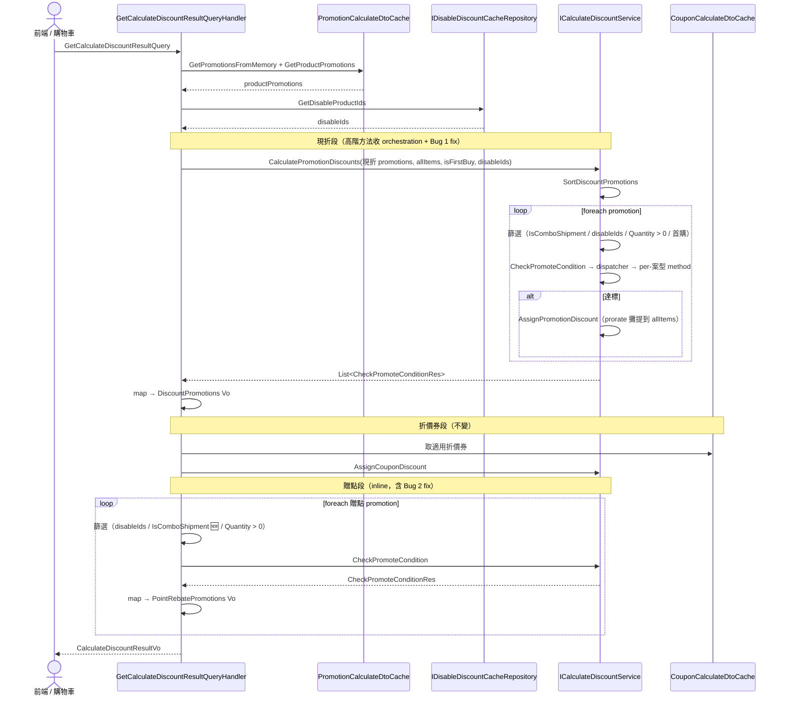
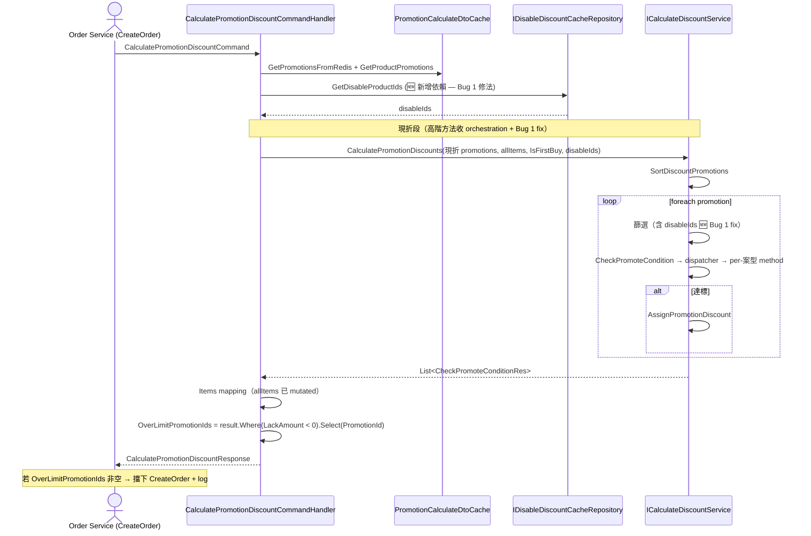

# PXBOX-26324 System Design — 現折新案型（Coupon Service）

## Req

### Objective

為 `PXBox.Coupon.Service` 新增「買一送一」（`BuyOneGetOne`）與「買N件Y元」（`NItemsYPrice`）兩個現折案型，涵蓋 DB 欄位擴充、後台驗證流程、折扣計算邏輯，以及下游事件同步。

---

### Current State

> 現行案型的折扣欄位使用矩陣與計算邏輯詳見 [`pxbox-26324_現況現折案型分析.md`](pxbox-26324_現況現折案型分析.md)

- 現折活動（`promote_way = 5`）支援四種案型：訂單滿件、訂單滿額、第N件折、首購滿件；折扣方式為金額或折數，可自由組合
- 系統不區分活動來源，所有活動均可由後台人工建立與修改內容
- 活動列表查詢不回傳 `pno_no`；搜尋條件含首購篩選
- 前台行銷標籤顯示順序與折扣套用順序各有固定排列，現行 8 個群組依序為：滿件/折數、滿件/折金、滿額/折數、滿額/折金、第N件/折數、第N件/折金、首購/折金、首購/折數
- 現折活動建立 / 修改時系統會檢查「商品 × 行銷檔期」是否重疊，現行衝突矩陣如下（❌ = 同商品同時段不可並存）：

  | 行銷類型 | 訂單滿件 | 訂單滿額 | 首購 | 第N件折 |
  |----------|:---:|:---:|:---:|:---:|
  | 訂單滿件 | ❌ | — | — | ❌ |
  | 訂單滿額 | — | ❌ | — | ❌ |
  | 首購 | — | — | ❌ | — |
  | 第N件折 | ❌ | ❌ | — | ❌ |

- 購物車內被標記為首購商品（`IsUseNewMemberPromotion = true`）的商品**最多只會有 1 個**（由前端 / 上游服務保證；本次需求不動此規則）
- 現行其他現折案型（滿件 / 滿額 / 第N件 / 首購）達到「累計折扣上限」後，僅截斷折扣金額，訂單仍可成立 — 系統不擋下訂單也不額外提示
- 現行**成單階段現折計算（`CalculatePromotionDiscountCommandHandler`）未排除「全站排除快取」內的商品**，與試算階段（`GetCalculateDiscountResultQueryHandler`，含現折與贈點計算）的排除邏輯不一致 — 屬於現有 bug
- 現行**試算階段贈點計算未過濾「組合商品」（`IsComboShipment = true`）**，與現折活動的過濾邏輯不一致 — 屬於現有 bug
- 現行**落帳階段贈點計算（`OrderWasPaidEventHandler`）不過濾全站排除快取與組合商品**，與試算 / 成單階段不一致 — 屬於現有 bug（Bug 3）。combo 資訊 producer（Order Service）已透過 `OrderWasPaidEvent.OrderItemDto.GroupId` 發出，係 Coupon 訂閱端 DTO 漏接 `GroupId` 欄位（`ItemAssignModel` 因而寫死 `IsComboShipment = false`）

---

### Proposed Changes

> 新案型的 DB 欄位設計與計算邏輯詳見 [`pxbox-26324_新增現折案型分析.md`](pxbox-26324_新增現折案型分析.md)

- 現折活動新增買一送一與 N件Y元 兩個案型，折扣計算加入對應邏輯，支援累折與觸發次數限制
- 系統區分活動來源：總部建立（`creator = "system"`）的活動後台僅允許結束，不可修改內容
- 上線後阻擋人工建立新案型，直至確認使用者開始使用（設計上易於解除）
- 活動列表查詢補上 `pno_no`；搜尋 Filter 新增 BuyOneGetOne 與 NItemsYPrice 篩選選項（首購篩選保留）
- `PromotionChangedEvent` 同步新欄位（`PerNQty`、`PerNPrice`）至下游
- 前台行銷標籤顯示順序與折扣套用順序依下表辦理
- **N件Y元 行銷標籤**：購物車畫面當商品在 N件Y元 適用範圍時顯示行銷標籤（例：「2件178」、「3件300」），協助消費者辨識優惠
- **系統同步 N件Y元 約束**：總部轉入的 N件Y元 活動，「門檻件數」與「分組件數」存相同值（總部來源不支援拆分設定）
- **達優惠上限擋訂單**：買一送一 / N件Y元 設定「觸發次數上限」時，若消費者購物車件數**超過上限可觸發件數**（例：限 2 組買一送一上限 4 件；限 2 組「3件Y元」上限 6 件）：
  - 購物車試算階段：顯示「已達優惠上限」訊息，引導消費者調整數量
  - 訂單成立階段：擋下訂單，需消費者調整到合法件數才能下單
- **修正篩選邏輯 bug（試算 + 成單 + 落帳階段全 Handler 一致）**：
  - Bug 1：成單階段現折計算（`CalculatePromotionDiscountCommandHandler`）補上「全站排除快取」排除邏輯
  - Bug 2：試算階段贈點計算（`GetCalculateDiscountResultQueryHandler` 贈點段）補上「組合商品」過濾邏輯
  - Bug 3：落帳階段贈點計算（`OrderWasPaidEventHandler`）補上「全站排除快取」排除 +「組合商品」過濾（combo 經接回 producer 已發出的 `OrderItemDto.GroupId` 推導）
  - **架構調整**：贈點過濾不再由各 handler 手寫，抽出 Service 新方法 `CalculatePointRebates`（firstbuy skip + combo / disable / qty0 過濾 + `CheckPromoteCondition`，回 per-promotion 結果，不做攤提）；**試算與落帳兩 handler 皆改用**，使「過濾＝計算行為」集中在 Service、handler 只負責 Vo / 持久化（T13 的試算 inline Bug 2 fix 由此吸收）
  - 修正後試算、成單、落帳三階段篩選規則（全站排除快取、組合商品、數量為 0）皆一致
  - ⚠️ **範圍修訂（2026-05-29）**：落帳階段（Bug 3）原列「本次需求不動」，因確認其 combo 阻擋因素（producer 已發 `GroupId`、Coupon 漏接）可在本 repo 內解除，遂納入本次範圍補完篩選一致性（見 Task T14）

**折扣套用順序與折上折風控：**

| 優先序 | 活動類型 | 來源 | 折扣群組 | 折上折風控 |
| :--- | :--- | :--- | :--- | :--- |
| 1-1 | 首購/折數 | 人工設定 | 會員群組（限首購會員，滿1件） | 不可重複折上折 |
| 1-2 | 首購/金額 | 人工設定 | 會員群組（限首購會員，滿1件） | 不可重複折上折 |
| 2-1 | 買一送一 | 人工設定 | 商品現折群組 | 不可重複折上折 |
| 2-2 | N件Y元 | 人工設定 | 商品現折群組 | 不可重複折上折 |
| 2-3 | 滿件/折數 | 人工設定 | 商品現折群組 | 不可重複折上折 |
| 2-4 | 滿件/金額 | 人工設定 | 商品現折群組 | 不可重複折上折 |
| 2-5 | 第N件折/折數 | 人工設定 | 商品現折群組 | 不可重複折上折 |
| 2-6 | 第N件折/金額 | 人工設定 | 商品現折群組 | 不可重複折上折 |
| 2-7 | 買一送一 | 系統同步（大全聯 N 特） | 商品現折群組 | 不可重複折上折 |
| 2-8 | N件Y元 | 系統同步(大全聯 N 特) | 商品現折群組 | 不可重複折上折 |
| 2-9 | 滿件/折數 | 系統同步(大全聯 / 轉單 / 預購 N 特) | 商品現折群組 | 不可重複折上折 |
| 2-10 | 滿件/金額 | 系統同步(大全聯 / 轉單 / 預購 N 特) | 商品現折群組 | 不可重複折上折 |
| 3-1 | 滿額/折數 | 人工設定 | 訂單滿額群組 | 不可重複折上折 |
| 3-2 | 滿額/金額 | 人工設定 | 訂單滿額群組 | 不可重複折上折 |

**前提：商品 × 行銷檔期重疊限制**

人工現折活動的「商品 × 行銷檔期」衝突矩陣沿用現行規則（見 Current State）；本案新增的系統同步活動（買一送一、N件Y元）檔期規則如下：

- **不**與人工現折活動檢查重疊（人工 + 系統同步可對同商品同時存在）
- 同商品在系統同步活動內**最多只屬於 1 個**（A 不會同時在 系統-買一送一-P1 與 系統-買一送一-P2；A 也不會同時在 系統-買一送一-P1 與 系統-N件Y元-P1）

**對同商品同時段可能存在的活動組合**（由上述前提推導）：

| 群組 | 最多活動數 | 來源組合 |
|---|---|---|
| 會員群組（1-1、1-2） | 1 個 | 1 個人工 |
| 商品現折群組（2-1 ~ 2-10） | 2 個 | 1 個人工 + 1 個系統同步 |
| 訂單滿額群組（3-1、3-2） | 1 個 | 1 個人工 |

**規則說明：**
- **不可重複折上折（per-product）**：依優先序逐一檢查，**對每個商品而言**，同個群組最多只有一個現折活動生效；某商品被某活動佔用該群組「席位」後，後續同群組活動對該商品跳過（但對其他商品仍可生效）。實際只會在「商品現折群組」內觸發（其他群組由前提保證最多 1 個）。
- **不同群組對同商品可並存**：對同一商品，會員群組生效一個 + 商品現折群組生效一個 + 訂單滿額群組生效一個 都允許。
- **編號規則**：優先序前綴對應折扣群組（1-X 會員、2-X 商品現折、3-X 訂單滿額），後綴為群組內排序。
- **系統同步活動排序在人工活動之後**：商品現折群組內，2-1 ~ 2-6（人工）優先於 2-7 ~ 2-10（系統同步），所以同商品若已有人工活動佔用商品現折群組席位，系統同步活動會被該商品跳過。
- **同類型活動內依流水號升序**：當同類型有多個活動時（如兩個買一送一適用不同商品），依流水號從小到大排（先建立的優先檢查）。

---

### Constraints

- **本 SD 範疇**：折扣計算邏輯（含 ServicePackage 均攤確認）；DB 欄位擴充、活動建立 / 編輯驗證、後台列表查詢、前台行銷標籤、下游事件同步，由另一位同仁負責，不在本範疇
- 現存現折活動的計算方式不變
- 新案型的檔期衝突群組定義與 System/Manual 重疊檢核分流，由負責總部轉入的同仁負責，不在本 SD 範疇
- `cumulate_limit` 在買一送一案型語義調整為觸發次數上限，DB 欄位不新增，沿用同欄位
- N件Y元的目標金額（Y元）以整數元儲存，不支援小數
- 系統同步來源（`creator = "system"`）的 N件Y元 活動：「門檻件數」與「分組件數」DB 寫入相同值（系統來源約束）
- 「達優惠上限擋訂單」涉及跨團隊協作：本 SD 範疇僅負責「試算階段回傳訊號」；前端負責「畫面提示」；Order Service 負責「擋訂單」

---

### Technical Impact Analysis

> ⚠️ TIA 為參考範圍，非完整規格。Pre Design Sync 與 Design 階段須重新讀程式碼確認細節。
>
> 📌 本 SD 後續規劃（Pre Design Sync、Design、Task）僅針對 **6. 折扣計算** 與 **7. ServicePackage 均攤**；其餘項目列出僅供範疇參考。

**範圍：`PXBox.Coupon.Service`（不含 `SyncHqPromotionJob`、`PromotionConflictGroupHelper`）**

#### 1. DB 欄位擴充

**現行：** `promotion` table 與 `PromotionEntity` 無 `per_n_qty`、`per_n_price`；`PromotionConditionType` 無新案型 enum 值。

**調整：** 新增兩個 DB 欄位與對應 Entity 屬性；新增 `BuyOneGetOne`、`NItemsYPrice` enum 值；系統同步來源的 N件Y元 寫入時兩欄位（`condition_amount`、`per_n_qty`）存相同值。

> 路徑：`Domain/AggregatesModel/PromotionAggregate/PromotionEntity.cs`、`sql/`

---

#### 2. 活動建立 / 編輯

**現行：** 驗證、暫存、儲存流程不支援新案型欄位；不區分活動來源，所有活動均可修改。

**調整：** 新增新案型欄位驗證與寫入；System 活動限制修改；上線後阻擋人工建立新案型。

> 路徑：`Application/Verifications/SavePromotionCommandVerification.cs`、`Application/Commands/PromotionCommands/EditDiscountPromotionCommandHandler.cs`

---

#### 3. 後台列表查詢

**現行：** 列表不回傳 `pno_no`；無 BuyOneGetOne / NItemsYPrice 篩選選項。

**調整：** 補上 `pno_no` 回傳；新增兩案型篩選選項（首購篩選保留）。

> 路徑：`Application/Queries/Backend/GetPromotionListQueryHandler.cs`

---

#### 4. 前台行銷標籤

**現行：** 標籤文字產生邏輯無新案型對應規則；排序群組無新案型插入位置。

**調整：** 新增兩案型標籤文字規則（N件Y元 顯示「N件Y元」字眼，例：2件178；買一送一 標籤文字 ⚠️ 待 PM 確認）；插入新排序群組（⚠️ 順序待 PM 確認）。

> 路徑：`Application/Cache/PromotionCalculateDto.cs`、`Application/Service/CalculateDiscountService.cs`

---

#### 5. 下游事件同步

**現行：** `PromotionChangedEvent` 缺少 `PerNQty`、`PerNPrice`（`PnoNo`、`Creator` 已存在）。

**調整：** 補上兩個新欄位。

> 路徑：`Application/IntegrationEvents/Events/PromotionChangedEvent.cs`

---

#### 6. 折扣計算

**現行：** 折扣計算無買一送一、N件Y元案型的折扣計算邏輯；達 `cumulate_limit` 截斷折扣後，無「已達上限」訊號回傳，訂單仍可成立。**篩選邏輯不一致 bug**：成單階段現折計算未排除「全站排除快取」；試算階段贈點計算未過濾「組合商品」。

**調整：** 新增買一送一、N件Y元案型的折扣計算邏輯；新增「達優惠上限」訊號回傳（件數超過 `cumulate_limit × per_n_qty` 時通知上游，供前端提示與 Order Service 擋訂單）；**修正篩選邏輯 bug**：成單階段現折補「全站排除快取」排除、試算階段贈點補「組合商品」過濾，試算 + 成單階段全 Handler 一致（落帳階段不動）。

> 路徑：`Application/Service/CalculateDiscountService.cs`、`Application/Queries/Frontend/GetCalculateDiscountResultQueryHandler.cs`

---

#### 7. ServicePackage DTO 擴充

**現行：** `CalculatePromotionDiscountResponse` DTO 無 `OverLimitPromotionIds` 欄位。

**調整：** ServicePackage 端 `CalculatePromotionDiscountResponse` DTO 同步加 `OverLimitPromotionIds: List<int>` 欄位；更新版號後推上 NuGet server。Order Service 升級 NuGet 後可接收 OverLimit 訊號。`DiscountHelper.Assign()` 不需擴充（只在 `GetAsync` 試算階段折價券攤提時用，Order Service 成單流程未呼叫此 path）。

> 路徑：`PXBox.Coupon.ServicePackage/Models/CalculatePromotionDiscountResponse.cs`

---


### Acceptance Criteria

驗收標準拆兩層：

**高階 AC（規則摘要 — PM 與 stakeholder validate spec）：**
- 📄 [pxbox-26324_ac.md](pxbox-26324_ac.md) — 含現折（AC-現折-N，涵蓋現折各案型 + 共用均攤 + Handler 整合層）、贈點（AC-贈點-N）、折價券（AC-折價券-N）

**詳細實例化 TC（含 Given/When/Then 與計算追蹤 — 工程師 / AI 寫測試）：**
- 📄 [pxbox-26324_tc_discount_promotion.md](pxbox-26324_tc_discount_promotion.md) — 現折單一活動內部邏輯（CalculateDiscountService）
- 📄 [pxbox-26324_tc_integrated.md](pxbox-26324_tc_integrated.md) — Handler 多活動整合行為
- 📄 [pxbox-26324_tc_rebate_promotion.md](pxbox-26324_tc_rebate_promotion.md) — 贈點迴歸保護（共用方法行為基準）
- 📄 [pxbox-26324_tc_coupon.md](pxbox-26324_tc_coupon.md) — 折價券攤回邏輯（迴歸保護）
### Req 進度表

| ID | 項目 | 狀態 |
| :--- | :--- | :--- |
| R1 | Objective | Done |
| R2 | Current State | Done |
| R3 | Proposed Changes | Done |
| R4 | Constraints | Done |
| R5 | Technical Impact Analysis | Done |
| R6 | Acceptance Criteria | Done |

---

## Pre Design Sync

### Q1 達優惠上限的訊號表達方式

Coupon Service 計算結果如何回傳「已達上限」這個狀態給上游（前端 / Order Service）。

| 方案 | Coupon Service 角色 | 上游處理 | 變動範圍 |
|---|---|---|---|
| A. boolean 欄位 | 計算結果新增 `IsOverLimit` boolean 與適用商品清單 | 上游讀 boolean 擋下訂單 / 顯示提示 | schema 變動最小 |
| B. status enum | 多狀態 `OK / OverLimit / LackThreshold` | 上游讀 enum 分流 | 改既有回傳 schema 較大 |
| C. throw exception | 直接 throw | 上層 catch | 試算階段也會被擋，不適合 |
| **D. 沿用 `lack_amount` 三態語義（決議方案）** | 用既有欄位 sign 表達：`> 0` 不符門檻、`= 0` 達標、`< 0` 超過上限 | 上游讀 sign 分流 | **schema 零變動** |

**結論**：採方案 D — 沿用既有 `lack_amount` 欄位，新增「`< 0` 表示超過上限且不計算折扣」語義。
- `lack_amount > 0`：不符合門檻（差幾件 / 差多少元）；不計算折扣
- `lack_amount = 0`：符合門檻；計算折扣
- `lack_amount < 0`：**超過上限（新增語義）**；不計算折扣

**實作風險**：現行 `lack_amount` ∈ {0, positive}，下游程式可能有「lack_amount ≥ 0」的隱含假設。Design 階段需 grep 確認所有 consumer（前端、Order Service、其他下游）支援負值處理；若有 risk，需評估 contract 通告。

> **Phase 3 前確認**：user 確認所有下游 consumer 會配合支援負值,risk 解除,不需發 contract 通告。

### Q2 「不能成立訂單」實際在哪一層擋？

| 方案 | 試算階段（購物車） | 訂單成立階段（CreateOrder） |
|---|---|---|
| **A. 兩階段協作（決議方案）** | Coupon Service 回 OverLimit 訊號；**前端**讀訊號顯示提示 | Coupon Service 也回 OverLimit 訊號；**Order Service** 讀訊號停止處理（不成立訂單、不寫發票、不寫帳務） |
| B. 只 CreateOrder 擋 | 照常算折扣，不提示 | Order Service 擋 |
| C. Coupon Service 試算回 0 折扣 + OverLimit | Coupon Service 主動 0 折扣 | Order Service 看訊號擋 |

**結論**：採方案 A。Coupon Service 本身**不擋訂單**，只負責回傳訊號 (`lack_amount < 0`)；前端讀訊號顯示提示，Order Service 讀訊號決定停止處理。

**範圍涵蓋**：兩個 Handler 都要回傳訊號
- `GetCalculateDiscountResultQueryHandler` (試算 / 購物車) → 前端讀
- `CalculatePromotionDiscountCommandHandler` (CreateOrder) → Order Service 讀

**衍生問題**：Service Handler 現行 response 結構（per-item 攤提）沒有 `lack_amount` 欄位 → 見 Q6。

### Q3 「達優惠上限」的判定範圍

**結論**：OverLimit 判定優先於 LackAmount — 只要「總件數 > `cumulate_limit × per_n_qty`」就算 OverLimit（即使該件數同時不符倍數 / 奇偶規則）。

**統一公式**（設 `max_valid = cumulate_limit × per_n_qty`、`min_valid = condition_amount`）：

| 件數狀況 | `lack_amount` 公式 | 語義 |
|---|---|---|
| 總件數 > `max_valid` | `-(總件數 - max_valid)` | **OverLimit**（需刪到合法上限） |
| 達標（≥ `min_valid` 且符合倍數 / 偶數規則 且 ≤ `max_valid`） | `0` | 計算折扣 |
| ≥ `min_valid` 但非倍數 / 奇數，且下個合法件數 ≤ `max_valid` | `下個合法件數 - 總件數` | LackAmount（未達倍數）|
| < `min_valid` | `min_valid - 總件數` | LackAmount（未達門檻）|

> 注意：`cumulate_limit = 0` 表示不限，OverLimit 永不觸發。

**買一送一限 2 組（`max_valid = 4`）範例**：

| 件數 | 判定 | `lack_amount` | 說明 |
|---|---|---|---|
| 0 / 1 | LackAmount | 2 / 1 | 差幾件達門檻 |
| 2 | 達標 1 組 | 0 | |
| 3（奇數）| LackAmount | 1 | 差 1 件達下個合法偶數 4 |
| 4 | 達標 2 組 | 0 | |
| 5 | **OverLimit** | **-1** | 超過 1 件，需刪到 4 |
| 6、7、8 | OverLimit | -2、-3、-4 | |

**N件Y元 3件Y元限 2 組（`max_valid = 6`）範例**：

| 件數 | 判定 | `lack_amount` |
|---|---|---|
| 2 | LackAmount | 1（差 1 達門檻 3）|
| 3 | 達標 1 組 | 0 |
| 4、5 | LackAmount | 2、1（差 N 達 6）|
| 6 | 達標 2 組 | 0 |
| 7、8、9 | OverLimit | -1、-2、-3 |

**範圍備註**：OverLimit 件數判定使用**排除規則後的件數**（首購商品排除、per-product 排除、全站排除快取後剩餘的件數）— 與現行 LackAmount 判定 input 一致。

### Q4 系統-N件Y元「門檻 = 分組件數」的實作方式

| 方案 | 實作 | 計算邏輯影響 |
|---|---|---|
| **A. DB 兩欄位寫相同值（決議方案）** | 系統同步 job 處理時，`condition_amount` 與 `per_n_qty` 都寫入相同值 | 計算邏輯**兩欄位都讀**（不簡化為單欄位）|
| B. condition_amount = NULL | 系統-N件Y元 只存 per_n_qty | 計算需判斷 NULL 處理 |
| C. 新 boolean 標記 | Promotion 加 `IsSystemSyncSameThreshold` | 計算需讀新欄位切換 |

**結論**：採方案 A。PM 已確認此設計是「**預開欄位**」— 不寫死「門檻 = N 件」，未來可能拆開設定。
- DB：系統同步 job 寫入時 `condition_amount = per_n_qty`
- 計算邏輯：**兩欄位都讀**（不假設兩欄位相等），保留未來分開設定的擴展性

### Q5 Frontend Handler response 為「N件Y元 行銷標籤」需擴充欄位（Req#1 衍生）

> Req#1（購物車顯示「2件178」標籤）細部需求補充：前端需要 N、Y 兩個值才能組合標籤文字。

| 值 | 前端取得方式 | Schema 變動 |
|---|---|---|
| **N（每組件數）** | 用既有 `PromotionCaculateSumVo.ConditionAmount`（前提：N件Y元 `condition_amount = per_n_qty`，Q4 確認）| 無 |
| **Y（目標金額）** | **新增 `PromotionCaculateSumVo.PerNPrice` 欄位** | +1 屬性 |

**結論**：`PromotionCaculateSumVo` 新增 `PerNPrice` 屬性 + 建構式賦值 `PerNPrice = promotion.PerNPrice`；同時更新 `ConditionType` 欄位註解（補 `6:買一送一 7:N件Y元`）。
- 範圍：僅 Frontend Handler（Service Handler 不顯示標籤；且 Q6 決議只回 PromotionIds list，不加 PerNPrice）
- 影響範圍：1 個 ViewModel 檔案、1 個 promotion DTO 屬性 mapping

### Q6 Service Handler response 擴充方式（Q2 衍生）

Service Handler 現行 response 只回 per-item 攤提結果，沒有 per-promotion 結果（無處放 `lack_amount`）。要讓 Order Service 收到 OverLimit 訊號，response schema 必須擴充。

| 方案 | 變動 | 上游使用 | 一致性 |
|---|---|---|---|
| A. 加 per-promotion result list | response 新增 `Promotions: List<PromotionResultRes>`，每筆含 `PromotionId / LackAmount` | Order Service 遍歷檢查任一筆 `LackAmount < 0` 即停 | 與 Frontend Handler 結構對齊 |
| **B. 加 top-level `OverLimitPromotionIds: List<int>`（決議方案）** | response 新增 list of 觸發 OverLimit 的 promotion id | Order Service 檢查 list 非空就停並 log promotion ids | 簡化，符合 Order Service 實際需要 |
| C. 加 top-level `HasOverLimit: bool` | response 新增 boolean | Order Service 檢查 true 就停 | 最簡，無法定位是哪個 promotion |
| D. throw exception | Service Handler 直接 throw | Order Service catch | 與試算階段「不 throw」不一致 |

**結論**：採方案 B。
- **背景**：前端在 Frontend Handler 試算階段就會擋下消費者繼續成單；Order Service 端的檢查是「保險層」（防機器人 / 直接呼叫 API 的客戶端）
- **設計取捨**：保險層可簡化實作；但仍需讓 Order Service 知道是哪些 promotion id 觸發 → 寫 log / 後續追查
- **實作**：
  - `CalculatePromotionDiscountResponse` 新增 `OverLimitPromotionIds: List<int>` 屬性
  - 計算邏輯：對每個 promotion 算完 condition 後，若 `lack_amount < 0` → 加入 list
  - Order Service：list 非空 → 擋下 CreateOrder 並 log promotion ids
  - 此 Handler 不回 `LackAmount` 細節（不需告知 Order Service 超過幾件，那是試算階段給前端的資訊）

### Q7 ServicePackage 對新案型與 OverLimit 訊號的支援範圍（Req#TIA-7 / Q6 衍生）

> 背景：TIA item 7「ServicePackage 均攤」標 in scope，但實際讀 `DiscountHelper.Assign()` 後發現此方法**只處理折價券攤提**（line 16-25 處理 `Coupons` field），現折活動攤提由本 service 內的 `CalculateDiscountService.AssignPromotionDiscount` 完成，**不經過 DiscountHelper**。
>
> Q6 結論 Service Handler 加 `OverLimitPromotionIds` 後，ServicePackage 端的 `CalculatePromotionDiscountResponse` DTO 需要同步擴充（目前無此欄位），才能讓 Order Service 透過 NuGet client 收到訊號。

**待釐清議題：**

**A. DiscountHelper.Assign() 是否需要為新案型擴充？**

| 方案 | 描述 | 影響 |
|---|---|---|
| **A1. 不擴充（決議建議）** | DiscountHelper 只處理折價券；現折活動（含新案型）攤提在本 service 內完成，無 cross-impact | 修正 TIA item 7 描述（DiscountHelper 跟新案型現折無關）|
| A2. 擴充 | 若有其他下游服務使用 DiscountHelper 對現折結果做 re-attribute | 需要確認沒有此 use case |

**B. ServicePackage 端 `CalculatePromotionDiscountResponse` DTO 是否擴充 `OverLimitPromotionIds`？**

| 方案 | 描述 | Deploy 影響 |
|---|---|---|
| **B1. 擴充 + 發新 NuGet 版本（決議建議）** | ServicePackage 端 DTO 同步加 `OverLimitPromotionIds: List<int>` 欄位；發新版 NuGet；Order Service 升級 NuGet 後即可接收訊號 | Order Service 升級前看不到此訊號 → 不擋訂單；前端在試算階段已能擋下大部分 case |
| B2. 不擴充 | Service Handler 回 OverLimit 訊號，但 ServicePackage 端 DTO 沒對應欄位 → Order Service 無法接收 → 擋訂單機制失效 | 不可行（違反 Q2/Q6 結論）|

**C. Deploy coordination 是否需特別處理？**

- Order Service 升級 NuGet 與本 service 部署的順序：本 service 先部署不會影響舊版 NuGet client（多餘欄位被忽略），所以**無嚴格順序要求**
- 升級期間：Order Service 不擋訂單，但前端在試算階段已擋（Q2/Q6 兩階段協作設計）→ 風險可接受
- 升級後：Order Service 補上擋訂單保險層

**建議結論**：
- DiscountHelper.Assign() 不需擴充；TIA item 7 描述應收斂為「ServicePackage 端 DTO 擴充 OverLimitPromotionIds」
- ServicePackage 發新版 NuGet，Order Service 升級即可
- Deploy 順序無嚴格要求；前端試算階段擋下足以避免大部分問題

**結論**：採建議方向，三子議題皆已確認：
- **A. DiscountHelper.Assign() 不擴充** — 已確認 `GetAsync`（內呼叫 DiscountHelper.Assign()）在 Order Service 成單流程未被呼叫；Order Service 成單只呼叫 `CalculatePromotionDiscount`（現折攤提）與 `GetAndCalculateCouponDiscount`（折價券攤提，攤提在 server side），均不經過 `DiscountHelper.Assign()`。
- **B. ServicePackage `CalculatePromotionDiscountResponse` 加 `OverLimitPromotionIds: List<int>`** — 已確認 Order Service 成單流程有呼叫 `CalculatePromotionDiscount`，需透過 ServicePackage DTO 接收 OverLimit 訊號。
- **C. Deploy 流程依現行 CI/CD 標準**：Coupon Service 改 ServicePackage 內容並更新版號 → 推上後自架 NuGet server 自動產新版 package → Order Service 升級引用新版即可。屬於實作工作的一部分，無額外 design 議題。

**TIA item 7 描述修正**：從「ServicePackage 均攤」收斂為「ServicePackage 端 DTO 擴充 OverLimitPromotionIds 欄位 + 發新版 NuGet」。

### Q8 CalculateDiscountService 抽象化（OCP / 測試切分）

> **術語注記**：本節「**既有 8 案型**」採前台排序群組粒度（4 個 condition type × 折數 / 金額 = 8）— 滿件/折數、滿件/金額、滿額/折數、滿額/金額、第N件/折數、第N件/金額、首購/折數、首購/金額。對應到 `CheckPromoteCondition` 計算邏輯為 **3 個 condition type 分支（OrderQuantity、OrderPrice、NthQuantity）+ 首購 flag 分支 + 折數/金額換算分支**。本次新增買一送一 / N件Y元 兩個 condition type，從前台粒度看則是 +2（系統同步來源各 1）。

> **背景**：在 Phase 2 收尾前 user 觀察到 `GetCalculateDiscountResultQueryHandler`（試算）與 `CalculatePromotionDiscountCommandHandler`（成單）兩個 Handler 內出現重複的 orchestration 程式碼：
>
> ```
> SortDiscountPromotions → foreach promotion →
>   首購商品篩選 → 商品篩選（IsComboShipment、disableAllDiscount、Quantity > 0）→
>   CheckPromoteCondition → 若 IsPass 則 AssignPromotionDiscount
> ```
>
> 這次新增買一送一 / N件Y元 兩個新案型,其門檻邏輯(數量規則、倍數規則)與既有 8 案型不同。現行 `CheckPromoteCondition` 內所有案型混在同一個 if/else 內,新增案型需要動到核心方法 → 既有案型受影響。

**問題本質：**

1. **OCP 違反**：新案型門檻邏輯加在 `CheckPromoteCondition` 內,動到既有 8 案型路徑 → 全案型回歸覆蓋
2. **DRY 違反**：Bug 1(成單補 disableAllDiscount 排除)+ Bug 2(試算贈點補 IsComboShipment)正好暴露兩 Handler 的重複 — 篩選邏輯一致性目前靠人工守
3. **測試成本高**：Handler 測試被迫覆蓋「計算邏輯 + Vo 組裝」兩件事,測案爆炸;單一案型計算邏輯無法獨立測試

**方案比較：**

> ❌ **方案 B（不 refactor，本次只做最小變動）已排除** — user 表示「現的程式碼已有些亂了，不想繼續累積」。下面只比較 A（method-level 拆分）與 C（只抽 orchestration）。

| 方案 | 變動範圍 | OCP 達成度 | 測試切分 | Bug 1/2 修法 | 既有案型回歸風險 |
|---|---|---|---|---|---|
| **A. method-level 拆分 + orchestration 抽離（建議）** | (1) 抽 `ICalculateDiscountService.CalculatePromotionDiscounts(...)` 高階方法（orchestration 收進來）(2) `CheckPromoteCondition` 內的 8 案型分支拆成 8 個 method（同 class 內），每案型獨立；新案型 = 加 2 個 method（買一送一 / N件Y元）(3) 共用邏輯（如累計門檻判定、折數/金額換算）用 private helper method 抽出，各案型 method 自由呼叫 | 高（既有 8 案型 method 零動；新案型 = 加 method + dispatch 一行；不引入 Strategy class 不增加類別數）| 完整：每案型 method 各自單測 + Service orchestration 單測 + Handler 只測 Vo mapping | 在 Service 內一處修，兩 Handler 自動一致 | 中（既有 8 案型計算邏輯從 if/else 拆成 method，邏輯本身不改，但 dispatch path 變動；回歸面 = 篩選 + 迴圈 + 8 案型 dispatch + 各 method 回歸）|
| **C. 折衷：只抽 orchestration** | (1) 抽 `ICalculateDiscountService.CalculatePromotionDiscounts(...)` 高階方法（orchestration 收進來）(2) 既有 `CheckPromoteCondition` / `AssignPromotionDiscount` 維持原樣（含新案型 if/else），只是變成 Service 內部呼叫 | 中（orchestration 不再動；新案型仍混在 `CheckPromoteCondition`）| Service orchestration 可單測 + Handler 只測 Vo mapping，**但 8 案型計算邏輯仍綁在 mixed if/else，難以個別測試** | 在 Service 內一處修，兩 Handler 自動一致 | 低（既有 8 案型計算邏輯不動，只是被高階方法包起來呼叫；回歸面只在「高階方法的篩選 + 迴圈 + return 結構」）|

**推薦方案 A 的理由：**

- **OCP 真正達成到案型粒度**：新案型 = 加 method，既有 8 案型 method 零動；C 仍動到 `CheckPromoteCondition` 既有 if/else
- **測試切到案型粒度**：每案型一個 method → 一個案型一組單測，邊界清楚；C 仍是 mixed method，單測會困在「測一個案型卻可能踩到其他 branch」
- **解掉 user 提的「程式碼已有些亂」根因**：mixed if/else 才是亂源；C 只擦了 Handler 層的灰塵，沒解到 method 內的 mixed
- **比 Strategy 輕量**：不引入 `IDiscountCaseStrategy` interface、不拆 N 個 class、不寫 factory；同 class 內 8 個 method + helper 即可
- **共用邏輯走 private helper**：例如「累計件數計算」「折數換金額」可抽 private method，各案型 method 直接呼叫，DRY 達成

**範疇釐清（若採 A）：**

- **In scope**：
  - 抽 `ICalculateDiscountService.CalculatePromotionDiscounts(...)` 高階方法
  - 兩個 Handler 改呼叫高階方法
  - 篩選邏輯（含 Bug 1/2 fix）收進高階方法
  - `CheckPromoteCondition` 內 8 案型 + 新增 2 案型 = 10 個 method 拆出（同 class 內）
  - 共用邏輯用 private helper 抽出
- **Out of scope**：
  - 不引入 Strategy pattern（無 interface、無 factory、不拆 class）
  - `AssignPromotionDiscount` 維持原樣（攤提邏輯本次不動）
  - 既有 8 案型計算「數字邏輯」內容零動（只是搬位置）
- **TC 影響**：
  - `tc_integrated.md` 的 Handler 層 TC 維持有效（黑盒驗證 Vo）
  - 新增 Service 單測類別，每案型 method 各自一組單測
  - tc_discount_promotion.md（單一案型內部邏輯）變成可由 Service 單測直接驗收

**Service Handler 與 Frontend Handler 的高階方法差異點：**

> 兩個 Handler 雖然 orchestration 結構相同，但 input / output 結構不同，需確認高階方法簽章是否能涵蓋兩者：

| 差異點 | Frontend Handler（試算）| Service Handler（成單）|
|---|---|---|
| 是否需要回傳 per-promotion `LackAmount` | 是（前端要顯示「差幾件 / 達上限」訊息）| 否（Order Service 只要 `OverLimitPromotionIds` list）|
| 是否含贈點計算 | 是 | 否 |
| 是否含 N件Y元 標籤資訊 | 是（`PerNPrice`）| 否 |
| Items 結構 | `PromotionCaculateSumVo`（含 lack_amount、per_n_price）| `ItemAssignModel`（純 per-item 攤提）|

→ 高階方法的「現折部分」可共用（input = promotions + items + isFirstBuy；output = items 攤提結果 + 每個 promotion 的 LackAmount/OverLimit）；贈點段仍留在 Frontend Handler 內（或拆獨立高階方法）。Service Handler 內 OverLimitPromotionIds list 由高階方法的 per-promotion result 推導。

**結論**：採方案 A（method-level 拆分 + orchestration 抽離）。

**落實項目：**

1. **新增 Service 高階方法** `ICalculateDiscountService.CalculatePromotionDiscounts(...)`，orchestration（排序、首購篩選、商品篩選、迴圈、IsPass 分支）收進來；簽章涵蓋兩 Handler 共用所需（input：promotions + allItems + isFirstBuy + isComboShipmentFilter + disableDiscountProductIds；output：items 攤提結果 + per-promotion LackAmount / OverLimit）
2. **Bug 1/2 修法** 收進高階方法的篩選 step，一處統一（兩 Handler 自動一致）
3. **`CheckPromoteCondition` 改為 dispatcher**（switch on `ConditionType`），原 mixed if/else 拆成 per-案型 private method：
   - 既有：`CheckOrderQuantity`、`CheckOrderPrice`、`CheckNthQuantity`（其中 `Duration` / `DurationQuantity` 共用既有滿件 / 滿額邏輯）
   - 新增：`CheckBuyOneGetOne`、`CheckNItemsYPrice`
4. **共用算式維持** `GetPromotionRebateAmount` / `GetNthDiscountAmount`（必要時加新 helper 給新案型，如 `CalculateBuyOneGetOneLack` 等），各案型 method 按需呼叫
5. **`AssignPromotionDiscount` 維持原樣**（攤提邏輯本次不動；已確認買一送一 / N件Y元 攤提沿用既有 prorate 邏輯，不拆 method）
6. **兩個 Handler 改呼叫高階方法**，response mapping 留在 Handler

**Out of scope**：
- 不引入 Strategy pattern（無 `IDiscountCaseStrategy` interface、無 factory、不拆 class）
- `AssignPromotionDiscount` 內部拆分（新案型攤提沿用既有 prorate 邏輯，已確認）
- 贈點段 orchestration（贈點僅在 Frontend Handler 內，不重複，本次不抽）— 待 Bug 3（落帳階段贈點不一致）議題啟動時再評估

**對後續階段的影響：**
- **Design 階段** 需新增 D 子章節「ICalculateDiscountService 高階方法設計」，內含：
  - 高階方法簽章（input / output type）
  - `CheckPromoteCondition` dispatcher + 10 個 per-案型 method 的方法簽章列表（method body 不寫，留 Task）
  - 兩 Handler 改為呼叫高階方法的呼叫關係圖
- **Task 階段** 需新增 refactor 對應 task（每案型 method 拆出可視為獨立 task，或捆綁為一個 refactor task）；既有 8 案型計算邏輯內容零動（只搬位置）→ 與 Bug 1/2 fix、新案型實作 task 並列

### Pre Design Sync 進度表

| ID | 項目 | 結論 | 狀態 |
| :--- | :--- | :--- | :--- |
| Q1 | 達優惠上限的訊號表達方式 | 沿用 `lack_amount` 三態語義（`> 0` 不符門檻、`= 0` 達標、`< 0` 超上限），schema 零變動 | Done |
| Q2 | 擋訂單在哪一層 | 兩階段協作；Coupon Service 不擋訂單，兩個 Handler 都回 OverLimit 訊號（試算→前端讀；CreateOrder→Order Service 讀） | Done |
| Q3 | 達優惠上限的判定範圍 | OverLimit 優先於 LackAmount；總件數 > `cumulate_limit × per_n_qty` 即 OverLimit（`lack_amount = -(超過件數)`），5 件 case 為 -1；判定 input 用排除規則後件數 | Done |
| Q4 | 系統-N件Y元 同欄位的實作方式 | PM 設計意圖為「預開欄位」，系統同步寫相同值；計算邏輯兩欄位都讀，保留未來分開設定的擴展性 | Done |
| Q5 | Frontend Handler response 為 N件Y元 標籤需擴充欄位（Req#1 衍生） | N 用既有 ConditionAmount；Y 新增 `PromotionCaculateSumVo.PerNPrice` 欄位 | Done |
| Q6 | Service Handler response 擴充方式（Q2 衍生） | 加 top-level `OverLimitPromotionIds: List<int>`（前端試算階段已擋，Order Service 保險層只需 promotion ids 用於 log / 追查） | Done |
| Q7 | ServicePackage 對新案型與 OverLimit 訊號的支援範圍（TIA-7 / Q6 衍生） | DiscountHelper 不擴充（成單流程未用）；ServicePackage DTO 加 `OverLimitPromotionIds` 並發新版 NuGet；TIA-7 描述修正為「DTO 擴充」 | Done |
| Q8 | CalculateDiscountService 抽象化（OCP / 測試切分） | 採方案 A：新增高階方法 `CalculatePromotionDiscounts`（收 orchestration + Bug 1/2 fix）；`CheckPromoteCondition` 改 dispatcher 並拆 per-案型 private method（既有 + 新案型共 10 個）；不引入 Strategy pattern；`AssignPromotionDiscount` 維持原樣 | Done |

---

## Design

> **Gate**：Phase 2 完成（Q1-Q8 全 Done），進入 Phase 3。
>
> **範圍**：
> 1. 新增買一送一 / N件Y元 兩案型計算邏輯（含 OverLimit 判定）
> 2. Bug 1 / Bug 2 篩選一致性修法
> 3. `CalculateDiscountService` method-level refactor（Q8）
> 4. Frontend Vo / Service response / ServicePackage DTO 擴充
>
> **不在 Design 範圍**（由另位同仁 / 另議題負責）：
> - 總部轉入 job（`SyncHqPromotionJob`、`PromotionConflictGroupHelper`）
> - 後台驗證 / 編輯流程（`SavePromotionCommandVerification`、`EditDiscountPromotionCommandHandler`）
> - 後台列表查詢（`pno_no` 回傳、新案型 filter）
> - 前台行銷標籤產生邏輯
> - 下游事件 `PromotionChangedEvent` schema 擴充
> - 落帳階段 `OrderWasPaidEventHandler` 篩選一致性（Bug 3）

### D1 DB Schema

> 📌 **DDL 由另一位同事負責，本 SD 不涵蓋撰寫工作**。
>
> DDL 檔案：`sql/20260514_add_promotions_bigpxmart_nspecial_columns.sql`
>
> **最終 schema**（依 Q4 結論）：
> - `promotions.per_n_qty` INT NOT NULL DEFAULT 0（每組件數，買一送一 / N件Y元 共用）
> - `promotions.per_n_price` INT NOT NULL DEFAULT 0（目標金額 Y，N件Y元 專用）
> - 同時加 `pno_no` UNIQUE INDEX（另一獨立任務）
>
> 本 Design 範疇：**消費 schema**（Entity 擴充屬性、計算邏輯讀取兩欄位），不負責 DDL 撰寫。

### D2 Entity / Domain（PromotionEntity + 內部 DTO 擴充）

**範疇分工**（兩屬性 `PerNQty: int`、`PerNPrice: int`）：

- **由另一位同事處理**（Domain 層，本 SD 不撰寫）：
  - `PromotionEntity` 屬性擴充對應 DB 欄位 `per_n_qty` / `per_n_price`
- **本 SD 負責**（Application/Cache 層）：
  - `PromotionCalculateDto` 屬性擴充（Entity → cache 的 mapping 點）
  - `ProductPromotionDto` 屬性擴充（cache 流出給 `CalculateDiscountService` 消費的 DTO）

> 路徑：`Application/Cache/PromotionCalculateDto.cs`（含 `PromotionCalculateDto` 與 `ProductPromotionDto` 兩 class）

### D3 Contract（Vo / Service response / ServicePackage DTO 擴充）

> 對應 Q5（Frontend Vo `PerNPrice`）、Q6（Service response `OverLimitPromotionIds`）、Q7（ServicePackage DTO 同步）

#### D3.1 Frontend Handler — `PromotionCaculateSumVo`

> 路徑：`Application/ViewModels/CalculateDiscountResultVo.cs`

**新增 property：**

```csharp
/// <summary>
/// 結算單位金額 Y（N件Y元用）；件數 N 由 ConditionAmount 承載
/// </summary>
public int PerNPrice { get; set; }
```

**既有 property 註解更新：**

| Property | 現行註解 | 更新後 |
|---|---|---|
| `ConditionType` | `門檻 1:滿件 2:滿額 3:期間累積滿額 4:期間累積滿件 5:N件N折` | `... 6:買一送一 7:N件Y元`（補新案型） |
| `LackAmount` | `門檻不足條件 差多少元或多少件` | `... 三態語義：>0 差幾件/差多少元；=0 達標；<0 超過上限（絕對值為超過件數）`（補 Q1 三態語義） |

#### D3.2 Service Handler / ServicePackage — `CalculatePromotionDiscountResponse`

> 路徑：`PXBox.Coupon.ServicePackage/Models/CalculatePromotionDiscountResponse.cs`
>
> 註：API 端 `CalculatePromotionDiscountCommandHandler` 直接 import 此 ServicePackage class 作為 response type，**單一 source of truth**，Q6 + Q7 結論為同一個動作。

**新增 top-level property：**

```csharp
/// <summary>
/// 觸發優惠上限的 promotion id 清單；Order Service 收到非空時擋下 CreateOrder
/// </summary>
public List<int> OverLimitPromotionIds { get; set; } = new List<int>();
```

#### D3.3 Deploy 流程（依 Q7 結論）

| 步驟 | 動作 |
|---|---|
| 1 | Coupon Service 改 ServicePackage DTO，更新 NuGet 版號，build 出新版 package 至自架 NuGet server |
| 2 | Coupon Service 部署新版（Order Service 仍用舊版 NuGet，看不到新欄位但不影響舊邏輯） |
| 3 | Order Service 升級 NuGet 引用新版 → 開始消費 `OverLimitPromotionIds` 擋訂單 |

→ **無嚴格部署順序要求**；升級過程中 Order Service 不擋訂單，但前端試算階段已擋（Q2/Q6 兩階段協作設計）

#### D3.4 TC 影響

- 高階 AC 與詳細 TC 為行為層級驗收，schema 擴充不影響驗收 path
- 新欄位「值正確性」驗收已含在現有 TC 內（如 N件Y元 案型 TC 含 `PerNPrice` 期望值；Handler 整合層 TC 含 `OverLimitPromotionIds` 期望值）
- 不需新增 TC 檔案

### D4 Service 抽象化（`ICalculateDiscountService` 高階方法 + dispatcher + per-案型 method）

#### D4.1 `ICalculateDiscountService` 介面變動

> 路徑：`Application/Service/ICalculateDiscountService.cs`

**新增 method signature（high-level orchestration）：**

```csharp
/// <summary>
/// 對 promotions 完整套用：排序 → 篩選（含 IsComboShipment / disableAllDiscount / Quantity > 0 / 首購）→
/// 門檻檢查 → 達標攤提。allItems 內各 item 的 PromotionDiscountAmount / Discounts 在方法內被 mutated；
/// 同時回傳 per-promotion 結果（含 LackAmount 三態語義）。
/// </summary>
List<CheckPromoteConditionRes> CalculatePromotionDiscounts(
    IEnumerable<ProductPromotionDto> promotions,
    List<ItemAssignModel> allItems,
    bool isFirstBuy,
    HashSet<int> disableDiscountProductIds);
```

**既有 method signatures 維持不變**（`GetProductScopeList` / `CheckPromoteCondition` / `AssignPromotionDiscount` / `SortDiscountPromotions` / `AssignCouponDiscount` / `CheckPromotionLimitPaymentType`）。

#### D4.2 新 type — **不需新增**

`CalculatePromotionDiscounts` 回傳值沿用既有 `CheckPromoteConditionRes`（位於 `Application/Models/CalculateDiscountModel/`）— 已含 `PromotionId / IsPass / LackAmount / DiscountAmount` 四欄，足以表達 per-promotion 結果。

#### D4.3 `CheckPromoteCondition` 改 dispatcher + per-案型 private method

`CheckPromoteCondition`（既有 public method，簽章不變）內部從 mixed if/else 改為 switch on `ConditionType`，路由到 5 個 per-案型 private method：

| ConditionType ID | 路由到 | 計算內容 |
|---|---|---|
| 1 (`OrderQuantity`) | `CheckOrderQuantity` | 件數判定 + `GetPromotionRebateAmount` |
| 2 (`OrderPrice`) | `CheckOrderPrice` | 金額判定 + `GetPromotionRebateAmount` |
| 3 (`Duration`) | `CheckOrderPrice`（共用）| 金額判定 + `GetPromotionRebateAmount` |
| 4 (`DurationQuantity`) | `CheckOrderQuantity`（共用）| 件數判定 + `GetPromotionRebateAmount` |
| 5 (`NthQuantity`) | `CheckNthQuantity` | 件數判定 + `GetNthDiscountAmount` |
| **6 (`BuyOneGetOne`)** | **`CheckBuyOneGetOne` 🆕** | 件數判定（含倍數 / OverLimit）+ 新算式 |
| **7 (`NItemsYPrice`)** | **`CheckNItemsYPrice` 🆕** | 件數判定（含倍數 / OverLimit）+ 新算式 |

**Per-案型 private method 簽章：**

```csharp
private CheckPromoteConditionRes CheckOrderQuantity(ProductPromotionDto promotion, List<ItemAssignModel> checkItems);
private CheckPromoteConditionRes CheckOrderPrice(ProductPromotionDto promotion, List<ItemAssignModel> checkItems);
private CheckPromoteConditionRes CheckNthQuantity(ProductPromotionDto promotion, List<ItemAssignModel> checkItems);
private CheckPromoteConditionRes CheckBuyOneGetOne(ProductPromotionDto promotion, List<ItemAssignModel> checkItems);   // 🆕
private CheckPromoteConditionRes CheckNItemsYPrice(ProductPromotionDto promotion, List<ItemAssignModel> checkItems);   // 🆕
```

各 method 內部 behaviour spec 見 D5；method body 留 Task。

#### D4.4 兩 Handler 改呼叫關係

**Frontend Handler（`GetCalculateDiscountResultQueryHandler`）：**

| 段落 | 改動 |
|---|---|
| 現折段 | 原本 foreach + 篩選 + CheckPromoteCondition + AssignPromotionDiscount → **一次呼叫** `CalculatePromotionDiscounts(...)`；從 return list `map` 到 `DiscountPromotions Vo` |
| 折價券段 | 維持原邏輯（不在本次範疇） |
| **贈點段** | **維持 inline orchestration**（贈點 Vo 結構與現折不同，不共用 `AssignPromotionDiscount`）；**需手動補 Bug 2 修法**（見 D5.4） |

**Service Handler（`CalculatePromotionDiscountCommandHandler`）：**

| 段落 | 改動 |
|---|---|
| 現折段 | 原本 foreach + 篩選 + CheckPromoteCondition + AssignPromotionDiscount → **一次呼叫** `CalculatePromotionDiscounts(...)` |
| response 組裝 | `Items` mapping 沿用既有（allItems 已被 mutated）；新增 `OverLimitPromotionIds = result.Where(x => x.LackAmount < 0).Select(x => x.PromotionId).ToList()` |
| 建構式依賴 | **新增** `IDisableDiscountCacheRepository` 注入（Frontend Handler 已有，Service Handler 需補） |

### D5 核心邏輯規格（新案型 behaviour、OverLimit 判定、Bug 1/2 修法）

#### D5.1 買一送一 — `CheckBuyOneGetOne` behavioural spec

> 對應 AC-現折-9（買一送一）。

**Input**：`promotion`（含 `per_n_qty`、`condition_amount`、`cumulate_limit`）；`checkItems`（已通過高階方法篩選）

**判定流程（順序執行，命中即 return）：**

1. **計算** `totalQty = checkItems.Sum(Quantity)`、`maxValid = cumulate_limit > 0 ? cumulate_limit × per_n_qty : ∞`
2. **OverLimit**：若 `totalQty > maxValid` → `IsPass = false`、`LackAmount = -(totalQty - maxValid)`、`DiscountAmount = 0`，return
3. **未達門檻**：若 `totalQty < condition_amount` → `IsPass = false`、`LackAmount = condition_amount - totalQty`、`DiscountAmount = 0`，return
4. **非倍數**：若 `totalQty % per_n_qty != 0` → 計算 `nextValid = ⌈totalQty / per_n_qty⌉ × per_n_qty`；`IsPass = false`、`LackAmount = nextValid - totalQty`、`DiscountAmount = 0`，return
5. **達標**：
   - `IsPass = true`、`LackAmount = 0`
   - `triggerCount = totalQty / per_n_qty`
   - 折扣金額計算（沿用 `GetNthDiscountAmount` 的 per-unit 攤平思路）：
     - 將 `checkItems` 內每件商品攤平為 unit-level（單價 = `Amount / Quantity`，最後一筆吸尾差）
     - 按 unit 單價 **升冪** 排序
     - 取最便宜 `triggerCount` 個 unit
     - `DiscountAmount = Σ(取出的 unit 單價)`

#### D5.2 N件Y元 — `CheckNItemsYPrice` behavioural spec

> 對應 AC-現折-10（N件Y元）。

**Input**：`promotion`（含 `per_n_qty`、`per_n_price`、`condition_amount`、`cumulate_limit`）；`checkItems`

**判定流程（順序執行）：**

1. **計算** `totalQty`、`maxValid` 同 D5.1
2. **OverLimit**：同 D5.1，`LackAmount = -(totalQty - maxValid)`
3. **未達門檻**：同 D5.1
4. **非倍數**：計算 `target = ⌈max(totalQty, condition_amount) / per_n_qty⌉ × per_n_qty`（同時滿足「≥ 門檻」與「per_n_qty 倍數」的最小件數），`LackAmount = target - totalQty`
5. **達標**：
   - `IsPass = true`、`LackAmount = 0`
   - `triggerCount = totalQty / per_n_qty`
   - 折扣金額計算：
     - per-unit 攤平 + 單價升冪排序
     - 取最便宜 `triggerCount × per_n_qty` 個 unit
     - `takenSum = Σ(取出的 unit 單價)`
     - `payable = triggerCount × per_n_price`
     - `DiscountAmount = takenSum - payable`
6. **反向折扣保護**（AC-N件Y元-反向折扣保護）：若 `DiscountAmount ≤ 0`，活動視為「不套用」：
   - `CheckNItemsYPrice` 回 `IsPass = true、LackAmount = 0、DiscountAmount = 0`
   - **`CalculatePromotionDiscounts` 高階方法**在 dispatch 結果回來後檢查：若 `IsPass = true && DiscountAmount = 0` → **不呼叫 `AssignPromotionDiscount`** 且 **不 add 到 return list**
   - 結果：前端 / Order Service 看不到該 promotion（符合 AC「不加入活動結果列表」），不會顯示 / 處理

> **設計取捨**：跳過邏輯放在 high-level 而非 `CheckNItemsYPrice` 內，理由為「per-案型 method 只負責 condition / 算式，不負責決策是否進結果列表」— 職責切乾淨。其他案型若日後也出現「達標但折 0」case，自然套用相同跳過規則。

#### D5.3 OverLimit 判定總表

| 案型 | `cumulate_limit` 既有語義 | 適用 OverLimit | 判定式 |
|---|---|---|---|
| 1/2/4 滿件 / 滿額 / 期間累積 | 折抵金額上限（超過則截斷） | 否 | — |
| 5 第N件折 | 折抵金額上限 / 單筆折扣上限 | 否 | — |
| **6 買一送一** | **觸發次數上限**（語義變更） | 是 | `totalQty > cumulate_limit × per_n_qty` |
| **7 N件Y元** | **觸發次數上限**（語義變更） | 是 | `totalQty > cumulate_limit × per_n_qty` |

OverLimit 判定**優先於** LackAmount 判定（先 reject 件數過多，再評估倍數 / 門檻）— 對應 Q3。

#### D5.4 Bug 1 / Bug 2 修法位置

| Bug | 場景 | 修法位置 | 動作 |
|---|---|---|---|
| **Bug 1** | Service Handler 成單階段 現折 缺 `disableAllDiscount` 排除 | **`CalculatePromotionDiscounts` 高階方法內篩選 step**（自動修） | 統一 filter：`!IsComboShipment && !disableIds.Contains(...) && promotion.ProductIds.Contains(...) && Quantity > 0` |
| Bug 1（迴歸） | Frontend Handler 試算階段 現折 已有 | 同上（行為一致） | 同上 |
| **Bug 2** | Frontend Handler 試算階段 **贈點** 缺 `IsComboShipment` 過濾 | **Frontend Handler 贈點段內**（手動補） | 贈點段未抽進高階方法；line 125 篩選改為 `Where(x => !x.IsComboShipment && promotion.ProductIds.Contains(...) && x.Quantity > 0)` |

修法後**試算 + 成單階段全 Handler** 篩選邏輯一致：
- 過濾組合商品（`IsComboShipment = true`）
- 過濾全站排除快取（`disableAllDiscount`）
- 過濾數量為 0 的 item

> 落帳階段 `OrderWasPaidEventHandler` 贈點仍不過濾（Bug 3，本次 out of scope）。

### D6 元件流程（試算 / 成單 序列圖）

#### D6.1 Frontend Handler 試算流程



#### D6.2 Service Handler 成單流程



### Design 進度表

| ID | 項目 | 狀態 |
| :--- | :--- | :--- |
| D1 | DB Schema | Done |
| D2 | Entity / Domain（PromotionEntity 擴充） | Done |
| D3 | Contract（Vo / Service response / ServicePackage DTO 擴充） | Done |
| D4 | Service 抽象化（`ICalculateDiscountService` 高階方法 + dispatcher + per-案型 method 簽章） | Done |
| D5 | 核心邏輯規格（新案型計算 behaviour、OverLimit 判定、Bug 1/2 修法） | Done |
| D6 | 元件流程（試算 / 成單 序列圖） | Done |

---

## Task

> **Gate**：Phase 3 完成（D1-D6 全 Done），進入 Phase 4。
>
> 依 `references/task-guidelines.md`：
> - Test 在 API Summary 後、Functional Implementation 前；**Fail-First**（failing test 先寫定義邊界）
> - 每個 task = 一個邏輯 commit
> - 預設 ≤ 3 files；可超檔的 mechanical exception 本 SD 不適用

### T1 Cache DTO 擴充（`PromotionCalculateDto` + `ProductPromotionDto` 加 `PerNQty` / `PerNPrice`）

- **Reference**：D2
- **Dependency**：`None`
- **Target**：`PXBox.Coupon.API` → `PromotionCalculateDto` / `ProductPromotionDto`
- **Implementation Details**：
  - 兩個 class 各新增屬性：
    ```csharp
    /// <summary>每組件數（買一送一 / N件Y元 共用）</summary>
    public int PerNQty { get; set; }

    /// <summary>目標金額 Y（N件Y元 專用）</summary>
    public int PerNPrice { get; set; }
    ```
  - `ProductPromotionDto(PromotionCalculateDto dto, int pid)` 建構式內補：
    ```csharp
    PerNQty = dto.PerNQty;
    PerNPrice = dto.PerNPrice;
    ```
  - **Entity → PromotionCalculateDto 的 cache loading mapping 由同事負責**（同 DDL / Entity 範疇），本 task 不動
- **Affected Files**：
  - `src/PXBox.Coupon.API/Application/Cache/PromotionCalculateDto.cs`

### T2 ServicePackage DTO — `CalculatePromotionDiscountResponse` 加 `OverLimitPromotionIds`

- **Reference**：D3.2
- **Dependency**：`None`
- **Target**：`PXBox.Coupon.ServicePackage` → `CalculatePromotionDiscountResponse`
- **Implementation Details**：
  - top-level 新增屬性：
    ```csharp
    /// <summary>觸發優惠上限的 promotion id 清單；Order Service 收到非空時擋下 CreateOrder</summary>
    public List<int> OverLimitPromotionIds { get; set; } = new List<int>();
    ```
  - 完成後更新 ServicePackage NuGet 版號（依專案現行 versioning convention），build 推上自架 NuGet server
- **Affected Files**：
  - `src/PXBox.Coupon.ServicePackage/Models/CalculatePromotionDiscountResponse.cs`
  - `src/PXBox.Coupon.ServicePackage/PXBox.Coupon.ServicePackage.csproj`（版號）

### T3 Frontend Vo — `PromotionCaculateSumVo` 加 `PerNPrice` + 註解更新

- **Reference**：D3.1
- **Dependency**：`None`
- **Target**：`PXBox.Coupon.API` → `PromotionCaculateSumVo`（位於 `CalculateDiscountResultVo.cs`）
- **Implementation Details**：
  - 新增屬性：
    ```csharp
    /// <summary>結算單位金額 Y（N件Y元用）；件數 N 由 ConditionAmount 承載</summary>
    public int PerNPrice { get; set; }
    ```
  - 建構式 `PromotionCaculateSumVo(ProductPromotionDto promotion, CheckPromoteConditionRes res)` 內補：
    ```csharp
    PerNPrice = promotion.PerNPrice;
    ```
  - 既有 `ConditionType` 註解 → 補新案型：`門檻 1:滿件 2:滿額 3:期間累積滿額 4:期間累積滿件 5:N件N折 6:買一送一 7:N件Y元`
  - 既有 `LackAmount` 註解 → 補三態語義：`門檻不足條件；三態語義：>0 差幾件 / 差多少元；=0 達標；<0 超過上限（絕對值為超過件數）`
- **Affected Files**：
  - `src/PXBox.Coupon.API/ViewModels/CalculateDiscountResultVo.cs`

### T4 API Summary — 給前端與 Order Service 的 contract 變更摘要

- **Reference**：D3
- **Dependency**：`T2`, `T3`
- **Target**：documentation only
- **Implementation Details**（產出 copy-paste-able summary doc）：
  - Frontend API（`GET /coupon/app/...`）`CalculateDiscountResultVo.DiscountPromotions[*]`：
    - 新增欄位 `per_n_price`（int）— N件Y元 結算單位金額 Y
    - 既有欄位 `condition_type` 新支援值：`6:買一送一`、`7:N件Y元`
    - 既有欄位 `lack_amount` 新支援負值：`<0` 表「超過上限」，絕對值為超過件數
  - Service API（`POST /service/1.0/coupon/CalculatePromotionDiscount`）`CalculatePromotionDiscountResponse`：
    - 新增 top-level 欄位 `over_limit_promotion_ids`（List<int>）— 觸發優惠上限的 promotion id 清單
  - 部署順序提醒（依 D3.3）：本 service 推 ServicePackage 新版 → Order Service 升級 NuGet
- **Affected Files**：
  - `docs/pxbox-26324_api_summary.md`（新檔）

### T5 Test — Frontend Handler `GetCalculateDiscountResultQuery` 整合測試（Fail-First）

- **Reference**：D4.4, D5, D6.1
- **Dependency**：`T1`, `T3`
- **Test Target**：`GetCalculateDiscountResultQueryHandler`
- **Implementation Details**：建立 failing tests，覆蓋以下情境（Given/When/Then）：
  - 買一送一 達標 → DiscountPromotions 含該活動，DiscountAmount 為「取最便宜 triggerCount 件單價合計」
  - 買一送一 OverLimit → DiscountPromotions 含該活動，`LackAmount = -(超過件數)`，`Amount = 0`
  - N件Y元 達標 → DiscountPromotions 含該活動，DiscountAmount 為「取最便宜 triggerCount × per_n_qty 件單價合計 - triggerCount × per_n_price」，且 `PerNPrice` 欄位有值
  - N件Y元 反向折扣保護（最便宜合計 ≤ Y）→ 該 promotion **不** 出現在 DiscountPromotions
  - Bug 2 迴歸：贈點段對 `IsComboShipment = true` 商品**不**累計（PointRebatePromotions 內計算結果排除 combo 商品）
- **Test File (DoD)**：`src/PXBox.Coupon.Test/GetCalculateDiscountResultQueryHandlerTests.cs`（新檔）
- **Affected Files**：
  - `src/PXBox.Coupon.Test/GetCalculateDiscountResultQueryHandlerTests.cs`

### T6 Test — Service Handler `CalculatePromotionDiscountCommand` 整合測試（Fail-First）

- **Reference**：D4.4, D5, D6.2
- **Dependency**：`T1`, `T2`
- **Test Target**：`CalculatePromotionDiscountCommandHandler`
- **Implementation Details**：建立 failing tests，覆蓋以下情境：
  - 買一送一 達標 → response.Items 內含對應折扣攤提，`OverLimitPromotionIds` 為空
  - 買一送一 OverLimit → response.Items 該活動無折扣，`OverLimitPromotionIds` 含該 promotionId
  - N件Y元 達標 → response.Items 內含對應攤提
  - N件Y元 反向折扣保護 → response.Items 該活動無折扣，**不** 列入 OverLimitPromotionIds（活動視為不適用）
  - Bug 1 迴歸：`disableAllDiscount` 內的商品**不**參與折扣計算（response.Items 中該商品 PromotionDiscountAmount = 0）
- **Test File (DoD)**：`src/PXBox.Coupon.Test/CalculatePromotionDiscountCommandHandlerTests.cs`（新檔）
- **Affected Files**：
  - `src/PXBox.Coupon.Test/CalculatePromotionDiscountCommandHandlerTests.cs`

### T7 Service 介面加高階方法 + 實作 orchestration（含 Bug 1 fix + 反向折扣跳過邏輯）

- **Reference**：D4.1, D4.4, D5.2 跳過邏輯, D5.4 Bug 1
- **Dependency**：`T1`
- **Target**：`PXBox.Coupon.API` → `ICalculateDiscountService` / `CalculateDiscountService`
- **Implementation Details**：
  - `ICalculateDiscountService` 加 method signature：
    ```csharp
    List<CheckPromoteConditionRes> CalculatePromotionDiscounts(
        IEnumerable<ProductPromotionDto> promotions,
        List<ItemAssignModel> allItems,
        bool isFirstBuy,
        HashSet<int> disableDiscountProductIds);
    ```
  - `CalculateDiscountService` 實作 method body：
    1. `var results = new List<CheckPromoteConditionRes>();`
    2. `var sorted = SortDiscountPromotions(promotions);`
    3. `foreach (var promotion in sorted)`：
       - 若 `promotion.IsFirstBuy && !isFirstBuy` → `continue;`
       - 商品篩選（**統一規則**）：
         ```csharp
         var checkItems = allItems.Where(x =>
             !x.IsComboShipment
             && !disableDiscountProductIds.Contains(x.ProductId)
             && promotion.ProductIds.Contains(x.ProductId)
             && x.Quantity > 0).ToList();
         ```
       - ⚠️ **首購活動門檻以整車適用商品判定**：首購商品 `IsUseNewMemberPromotion` 過濾**只在 `AssignPromotionDiscount` 攤提階段**套用（見 step 2-3 與既有實作），**不可**在 `CheckPromoteCondition` 之前過濾 `checkItems`——否則「首購標記=是 + 購物車無首購商品」時會誤判門檻不過（IsPass=false），違反既有行為。對齊 main 既有邏輯，見 `TC-整合-首購-7`（修正：原虛擬碼此處誤加首購過濾，造成迴歸 → 移除）
       - `var res = CheckPromoteCondition(promotion, checkItems);`
       - **N件Y元 反向折扣跳過判定**：若 `res.IsPass && res.DiscountAmount == 0` → 不 add 到 `results`，**不** 呼叫 `AssignPromotionDiscount`，`continue;`
       - `results.Add(res);`
       - 若 `res.IsPass` → `AssignPromotionDiscount(promotion, res, ref allItems);`
    4. `return results;`
- **Affected Files**：
  - `src/PXBox.Coupon.API/Application/Service/ICalculateDiscountService.cs`
  - `src/PXBox.Coupon.API/Application/Service/CalculateDiscountService.cs`

### T8 Service `CheckPromoteCondition` 改 dispatcher + 拆既有 3 個 per-案型 private method

- **Reference**：D4.3（既有 case 部分）
- **Dependency**：`T7`
- **Target**：`PXBox.Coupon.API` → `CalculateDiscountService`
- **Implementation Details**：
  - `CheckPromoteCondition` public method body 改為 switch：
    ```csharp
    public CheckPromoteConditionRes CheckPromoteCondition(ProductPromotionDto promotion, List<ItemAssignModel> checkItems)
    {
        return promotion.ConditionType switch
        {
            var t when t == PromotionConditionType.OrderQuantity.Id    => CheckOrderQuantity(promotion, checkItems),
            var t when t == PromotionConditionType.OrderPrice.Id       => CheckOrderPrice(promotion, checkItems),
            var t when t == PromotionConditionType.Duration.Id         => CheckOrderPrice(promotion, checkItems),
            var t when t == PromotionConditionType.DurationQuantity.Id => CheckOrderQuantity(promotion, checkItems),
            var t when t == PromotionConditionType.NthQuantity.Id      => CheckNthQuantity(promotion, checkItems),
            _ => new CheckPromoteConditionRes(promotion.PromotionId)
        };
    }
    ```
  - 拆出 3 個 private method（直接搬既有 if/else 對應段落到新 method 內，內容不改）：
    - `CheckOrderQuantity`：原「件數類」分支（計算 `itemQtyTotal`、判 `>= ConditionAmount`、若達標呼叫 `GetPromotionRebateAmount`）
    - `CheckOrderPrice`：原「金額類」分支（計算 `totalAmount`、判 `>= ConditionAmount`、若達標呼叫 `GetPromotionRebateAmount`）
    - `CheckNthQuantity`：原「第N件」分支（件數判定 + 呼叫 `GetNthDiscountAmount`）
  - 注意：`GetPromotionRebateAmount` / `GetNthDiscountAmount` 既有 private method 維持不動
- **Affected Files**：
  - `src/PXBox.Coupon.API/Application/Service/CalculateDiscountService.cs`

### T9 Test — Service `CalculateDiscountService` per-案型 method unit test（Fail-First）

- **Reference**：D4.3, D5.1, D5.2, D5.3
- **Dependency**：`T8`
- **Test Target**：`CalculateDiscountService`
- **Implementation Details**：建立 5 個 per-案型 method 的 unit test 覆蓋：
  - **既有 3 個案型**（refactor 後應 pass，作為迴歸保護）：
    - `CheckOrderQuantity`：未達 / 達標 / 達標+累折上限
    - `CheckOrderPrice`：未達 / 達標 / 達標+累折上限
    - `CheckNthQuantity`：未達 / 達標 / 達標+累折上限
  - **新 2 個案型**（實作前 fail）：
    - `CheckBuyOneGetOne`：依 D5.1 五步流程，每步至少 1 test case（OverLimit / 未達門檻 / 非倍數 / 達標含 triggerCount 倍數計算 / 達標折扣金額 = 取最便宜 triggerCount 件合計）
    - `CheckNItemsYPrice`：依 D5.2 六步流程，含「反向折扣保護」case（DiscountAmount = 0 且後續被 high-level 跳過 — 此 test 直接驗 method return,而 high-level 跳過 in T5/T6 integration test 驗）
- **Test File (DoD)**：`src/PXBox.Coupon.Test/CalculateDiscountServiceTests.cs`（新檔）
- **Affected Files**：
  - `src/PXBox.Coupon.Test/CalculateDiscountServiceTests.cs`

### T10 Service 新增 `CheckBuyOneGetOne` private method

- **Reference**：D4.3, D5.1, D5.3
- **Dependency**：`T9`（test 先寫 fail）
- **Target**：`PXBox.Coupon.API` → `CalculateDiscountService.CheckBuyOneGetOne`
- **Implementation Details**：
  - method signature：`private CheckPromoteConditionRes CheckBuyOneGetOne(ProductPromotionDto promotion, List<ItemAssignModel> checkItems)`
  - 依 D5.1 五步流程實作 body：
    1. `totalQty = checkItems.Sum(x => x.Quantity);`、`maxValid = promotion.CumulateLimit > 0 ? promotion.CumulateLimit * promotion.PerNQty : int.MaxValue;`
    2. **OverLimit**：若 `totalQty > maxValid` → `IsPass=false`, `LackAmount = -(totalQty - maxValid)`, return
    3. **未達門檻**：若 `totalQty < promotion.ConditionAmount` → `IsPass=false`, `LackAmount = promotion.ConditionAmount - totalQty`, return
    4. **非倍數**：若 `totalQty % promotion.PerNQty != 0` → `nextValid = ((totalQty / promotion.PerNQty) + 1) * promotion.PerNQty`, `IsPass=false`, `LackAmount = nextValid - totalQty`, return
    5. **達標**：
       - `IsPass=true`, `LackAmount=0`, `triggerCount = totalQty / promotion.PerNQty`
       - 折扣金額計算（沿用 `GetNthDiscountAmount` per-unit 攤平思路）：
         - 將 `checkItems` 內每件商品攤平為 unit list（單價 = `Amount / Quantity`，最後一筆吸尾差）
         - 按單價升冪排序
         - 取最便宜 `triggerCount` 個 unit
         - `DiscountAmount = sum(取出的 unit 單價)`
  - 在 `CheckPromoteCondition` dispatcher 加 case：`var t when t == PromotionConditionType.BuyOneGetOne.Id => CheckBuyOneGetOne(promotion, checkItems),`
- **Affected Files**：
  - `src/PXBox.Coupon.API/Application/Service/CalculateDiscountService.cs`

### T11 Service 新增 `CheckNItemsYPrice` private method

- **Reference**：D4.3, D5.2, D5.3
- **Dependency**：`T9`（test 先寫 fail）
- **Target**：`PXBox.Coupon.API` → `CalculateDiscountService.CheckNItemsYPrice`
- **Implementation Details**：
  - method signature：`private CheckPromoteConditionRes CheckNItemsYPrice(ProductPromotionDto promotion, List<ItemAssignModel> checkItems)`
  - 依 D5.2 六步流程實作 body：
    1. `totalQty` / `maxValid` 同 T10
    2. OverLimit：同 T10
    3. 未達門檻：同 T10
    4. 非倍數：`target = ((Math.Max(totalQty, promotion.ConditionAmount) + promotion.PerNQty - 1) / promotion.PerNQty) * promotion.PerNQty;`, `LackAmount = target - totalQty;`, `IsPass=false`, return
    5. 達標：
       - `IsPass=true`, `LackAmount=0`, `triggerCount = totalQty / promotion.PerNQty`
       - per-unit 攤平 + 單價升冪排序
       - 取最便宜 `triggerCount * promotion.PerNQty` 個 unit
       - `takenSum = sum(取出的 unit 單價)`, `payable = triggerCount * promotion.PerNPrice`
       - `DiscountAmount = takenSum - payable`
    6. 反向折扣保護：若 `DiscountAmount <= 0` → `IsPass=true, LackAmount=0, DiscountAmount=0`（後續由 high-level `CalculatePromotionDiscounts` 跳過）
  - 在 `CheckPromoteCondition` dispatcher 加 case：`var t when t == PromotionConditionType.NItemsYPrice.Id => CheckNItemsYPrice(promotion, checkItems),`
- **Affected Files**：
  - `src/PXBox.Coupon.API/Application/Service/CalculateDiscountService.cs`

### T12 兩個 Handler 改呼叫高階方法 + Service Handler 補注入 `IDisableDiscountCacheRepository`

- **Reference**：D4.4
- **Dependency**：`T7`
- **Target**：
  - `PXBox.Coupon.API` → `GetCalculateDiscountResultQueryHandler`（現折段改寫）
  - `PXBox.Coupon.API` → `CalculatePromotionDiscountCommandHandler`（現折段改寫 + DI）
- **Implementation Details**：
  - **Service Handler `CalculatePromotionDiscountCommandHandler`**：
    - 建構式新增 `IDisableDiscountCacheRepository` 依賴注入
    - `Handle` 內取 `var disableIds = (await _disableDiscountCacheRepository.GetDisableProductIds()).ToHashSet();`
    - 移除原 foreach + 篩選 + CheckPromoteCondition + AssignPromotionDiscount block（line 40-66），改為：
      ```csharp
      var results = _calculateDiscountService.CalculatePromotionDiscounts(
          productPromotions.Where(x => x.PromoteWay == PromoteWay.Discount.Id),
          allItems,
          request.IsFirstBuy,
          disableIds);
      ```
    - response 組裝末段加：
      ```csharp
      OverLimitPromotionIds = results.Where(x => x.LackAmount < 0).Select(x => x.PromotionId).ToList()
      ```
  - **Frontend Handler `GetCalculateDiscountResultQueryHandler`**：
    - **僅改現折段**（line 60-95 範圍），改為呼叫 `CalculatePromotionDiscounts`，從 return list 對每個 `CheckPromoteConditionRes` `new PromotionCaculateSumVo(promotion, res)` 加進 `result.DiscountPromotions`
    - 折價券段、贈點段、Products mapping 維持不動（贈點段 Bug 2 在 T13 修）
- **Affected Files**：
  - `src/PXBox.Coupon.API/Application/Queries/Frontend/GetCalculateDiscountResultQueryHandler.cs`
  - `src/PXBox.Coupon.API/Application/Commands/ServiceCommands/CalculatePromotionDiscountCommandHandler.cs`

### T13 Frontend Handler 贈點段 Bug 2 fix（補 `IsComboShipment` 過濾）

- **Reference**：D5.4 Bug 2
- **Dependency**：`T12`（同檔避免衝突，序列在後）
- **Target**：`PXBox.Coupon.API` → `GetCalculateDiscountResultQueryHandler`（贈點段）
- **Implementation Details**：
  - `GetCalculateDiscountResultQueryHandler.Handle` 內贈點段（line 114-129 區域），篩選改為：
    ```csharp
    var checkItems = allItems.Where(x =>
        !x.IsComboShipment                                   // 🆕 Bug 2 fix
        && promotion.ProductIds.Contains(x.ProductId)
        && x.Quantity > 0).ToList();
    ```
- **Affected Files**：
  - `src/PXBox.Coupon.API/Application/Queries/Frontend/GetCalculateDiscountResultQueryHandler.cs`

### T14 修訂 plan 範圍 — 落帳階段納入篩選一致性（Bug 3）

- **Reference**：Current State Bug 3 / Proposed Changes 修正篩選 bug 段
- **Dependency**：—
- **Target**：`docs/pxbox-26324_plan.md`（文件變更，零程式碼）
- **Current state**：plan 原將落帳階段贈點篩選列「本次需求不動」，combo 被誤判為需跨服務契約變更而擱置
- **Goal**：解除誤判（producer 已發 `GroupId`、僅 Coupon 漏接），把 Bug 3 正式納入「全 Handler 篩選一致」範圍，使 T15/T16 的 append 不違反 Req
- **Implementation Details**：
  - Current State：將落帳「屬於另一議題，本次需求不動」改為「屬於現有 bug（Bug 3）」，與 Bug 1 / Bug 2 並列；補註 `GroupId` 漏接事實
  - Proposed Changes：修正篩選 bug 段標題加入「落帳」、新增 Bug 3 條目、移除「落帳階段不在本次範圍」、記錄範圍修訂理由與日期
- **Affected Files**：
  - `docs/pxbox-26324_plan.md`

### T15 Test — Service `CalculatePointRebates` 排除 combo / disable（Fail-First）

- **Reference**：Bug 3
- **Dependency**：`T14`
- **Target**：`PXBox.Coupon.Test` → `CalculateDiscountServiceRebateTests`（新增分檔或既有檔）
- **Current state**：贈點過濾散在兩個 handler 手寫，Service 無贈點過濾方法、無對應測試
- **Goal**：以紅燈鎖死「Service 層贈點計算需排除 combo / disable / qty0、firstbuy skip，且回傳結果的 `ProductIds` 反映排除」，先驗測試抓得到、再進 T16
- **Implementation Details**：
  - 先在 `ICalculateDiscountService` 加 `CalculatePointRebates(...)` 簽章 + 擲 `NotImplementedException` 暫實作，使測試可編譯且紅
  - 沿用 `CalculateDiscountServiceTests` 的 `Run` / `Item` / `ComboItem` helper 風格
  - 案例（disable）：贈點活動適用 A、B，A 在 disable set → 結果只反映 B，且 `ProductIds` 不含 A
  - 案例（combo）：A `IsComboShipment=true`、B 否 → 結果只反映 B
  - 案例（firstbuy skip）：`promotion.IsFirstBuy && isFirstBuy=false` → 該活動不回傳
- **Affected Files**：
  - `src/PXBox.Coupon.Test/Application/Service/CalculateDiscountServiceRebateTests.*.cs`
  - `src/PXBox.Coupon.API/Application/Service/ICalculateDiscountService.cs`（加簽章）

### T16 Service — 實作 `CalculatePointRebates`（過濾收斂進 Service）

- **Reference**：Bug 3
- **Dependency**：`T15`
- **Target**：`PXBox.Coupon.API` → `CalculateDiscountService`
- **Current state**：T15 已加簽章 + NotImplemented stub（紅）
- **Goal**：實作贈點過濾 + 檢查，使 T15 轉綠；過濾行為自此屬 Service
- **Implementation Details**：
  - `CalculatePointRebates(IEnumerable<ProductPromotionDto> promotions, List<ItemAssignModel> allItems, bool isFirstBuy, HashSet<int> disableDiscountProductIds)`：
    - `promotion.IsFirstBuy && !isFirstBuy` → skip
    - checkItems = `!IsComboShipment && !disable.Contains(pid) && promotion.ProductIds.Contains(pid) && Quantity>0`
    - 將 `promotion.ProductIds` 更新為存活 pid（使 Vo `product_ids` 反映排除，對齊 tc_integrated 篩選-05）
    - 對每個存活活動呼叫 `CheckPromoteCondition`，回傳 per-promotion 結果（含 PromotionId 供 handler 對應）
    - **不**做攤提、**不**做付款方式檢查（付款檢查屬落帳 handler 前置責任）
- **Affected Files**：
  - `src/PXBox.Coupon.API/Application/Service/ICalculateDiscountService.cs`
  - `src/PXBox.Coupon.API/Application/Service/CalculateDiscountService.cs`

### T17 落帳 Handler 改用 `CalculatePointRebates` + 接回 GroupId

- **Reference**：Bug 3
- **Dependency**：`T16`
- **Target**：`PXBox.Coupon.API` → `OrderWasPaidEvent` / `ItemAssignModel` / `OrderWasPaidEventHandler`
- **Current state**：訂閱端 DTO 缺 `GroupId`、`ItemAssignModel` 寫死 `IsComboShipment=false`、落帳贈點手寫迴圈不過濾且不注入 disable cache
- **Goal**：落帳贈點走 Service 過濾、combo 資訊接回，與試算 / 成單一致
- **Implementation Details**：
  - `OrderWasPaidEvent.OrderItemDto`（訂閱端）新增 `public string GroupId { get; set; }`，接回 producer 已發出欄位
  - `ItemAssignModel(OrderWasPaidEvent.OrderItemDto)`：改 `IsComboShipment = !string.IsNullOrEmpty(item.GroupId)`（比照折價券路徑 `:54`）
  - `OrderWasPaidEventHandler` 注入 `IDisableDiscountCacheRepository`；以付款方式檢查 + firstbuy 前置篩出贈點活動後，改呼叫 `CalculatePointRebates(...)`，由結果建 `PointRebateResultEntity`
  - 移除手寫 checkItems / 過濾段
- **Affected Files**：
  - `src/PXBox.Coupon.API/Application/IntegrationEvents/SubscribeEvents/OrderWasPaidEvent.cs`
  - `src/PXBox.Coupon.API/Application/Models/CalculateDiscountModel/ItemAssignModel.cs`
  - `src/PXBox.Coupon.API/Application/IntegrationEvents/EventHandling/OrderWasPaidEventHandler.cs`

### T18 試算 Handler 改用 `CalculatePointRebates`（吸收 T13 inline fix）

- **Reference**：Bug 3 / 取代 T13 機制
- **Dependency**：`T16`
- **Target**：`PXBox.Coupon.API` → `GetCalculateDiscountResultQueryHandler`（贈點段）
- **Current state**：試算贈點段手寫迴圈（`RemoveAll(disable)` + checkItems `!IsComboShipment`），即 T13 的 inline Bug 2 fix
- **Goal**：試算贈點段改用 `CalculatePointRebates`，過濾不再由 handler 控制；行為不變（既有 篩選-05/06 等測試續綠）
- **Implementation Details**：
  - 將贈點段手寫迴圈替換為 `CalculatePointRebates(pointPromotions, allItems, request.IsFirstBuy, disableAllDiscount.ToHashSet())`，由結果建 `PromotionCaculateSumVo`
  - 驗證既有 Frontend Handler 贈點測試（篩選-05/06 等）不回歸
- **Affected Files**：
  - `src/PXBox.Coupon.API/Application/Queries/Frontend/GetCalculateDiscountResultQueryHandler.cs`

### Task 進度表

| ID | 項目 | 引用 | 依賴 | 狀態 |
| :--- | :--- | :--- | :--- | :--- |
| T1 | Cache DTO 擴充（`PromotionCalculateDto` + `ProductPromotionDto`） | D2 | None | Review |
| T2 | ServicePackage DTO 加 `OverLimitPromotionIds` | D3.2 | None | Review |
| T3 | Frontend Vo 加 `PerNPrice` + 註解 | D3.1 | None | Review |
| T4 | API Summary | D3 | T2, T3 | Review |
| T5 | Test — Frontend Handler 整合測試（Fail-First） | D4.4, D5, D6.1 | T1, T3 | Review |
| T6 | Test — Service Handler 整合測試（Fail-First） | D4.4, D5, D6.2 | T1, T2 | Review |
| T7 | Service 介面加高階方法 + 實作（含 Bug 1 fix + 反向折扣跳過） | D4.1, D4.4, D5.2, D5.4 | T1 | Review |
| T8 | `CheckPromoteCondition` 改 dispatcher + 拆既有 3 個 method | D4.3 | T7 | Review |
| T9 | Test — Service per-案型 method unit test（Fail-First） | D4.3, D5.1, D5.2, D5.3 | T8 | Review |
| T10 | 實作 `CheckBuyOneGetOne` | D4.3, D5.1, D5.3 | T9 | Review |
| T11 | 實作 `CheckNItemsYPrice` | D4.3, D5.2, D5.3 | T9 | Review |
| T12 | 兩 Handler 改呼叫高階方法 + Service Handler 補 DI | D4.4 | T7 | Review |
| T13 | Frontend Handler 贈點段 Bug 2 fix | D5.4 Bug 2 | T12 | Review |
| T14 | 修訂 plan 範圍 — 落帳納入篩選一致性（Bug 3） | Bug 3 | None | Review |
| T15 | Test — Service `CalculatePointRebates` 排除 combo / disable（Fail-First） | Bug 3 | T14 | Review |
| T16 | Service — 實作 `CalculatePointRebates`（過濾收斂進 Service） | Bug 3 | T15 | Review |
| T17 | 落帳 Handler 改用 `CalculatePointRebates` + 接回 GroupId | Bug 3 | T16 | Review |
| T18 | 試算 Handler 改用 `CalculatePointRebates`（吸收 T13 inline fix） | Bug 3 | T16 | Review |

---

## 後續：測試補強

第一輪實作（T1-T13）的測試覆蓋低於 TC 文件規格，測試補強 Task 拆至獨立檔：

📄 **[pxbox-26324_task_test_coverage.md](pxbox-26324_task_test_coverage.md)** — 依四份 TC 文件（共 189 個 TC case）1:1 補齊 `CalculateDiscountService` 與各 Handler 的測試覆蓋。

---

## 後續：測試檔 Refactor

測試補強完成後 `CalculateDiscountServiceTests.cs` 累積到 2425 行，單檔過長影響閱讀與導航，拆分 Task 拆至獨立檔：

📄 **[pxbox-26324_task_refactor.md](pxbox-26324_task_refactor.md)** — 將 `CalculateDiscountServiceTests.cs` 以 C# `partial class` 機制拆為 1 helpers 主檔 + 8 案型分檔，零行為變更。
