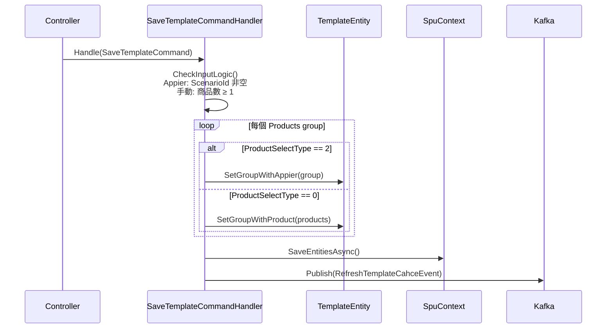
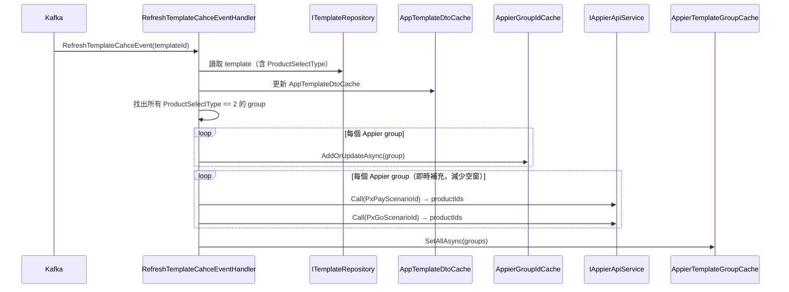
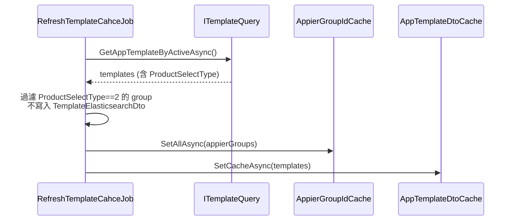
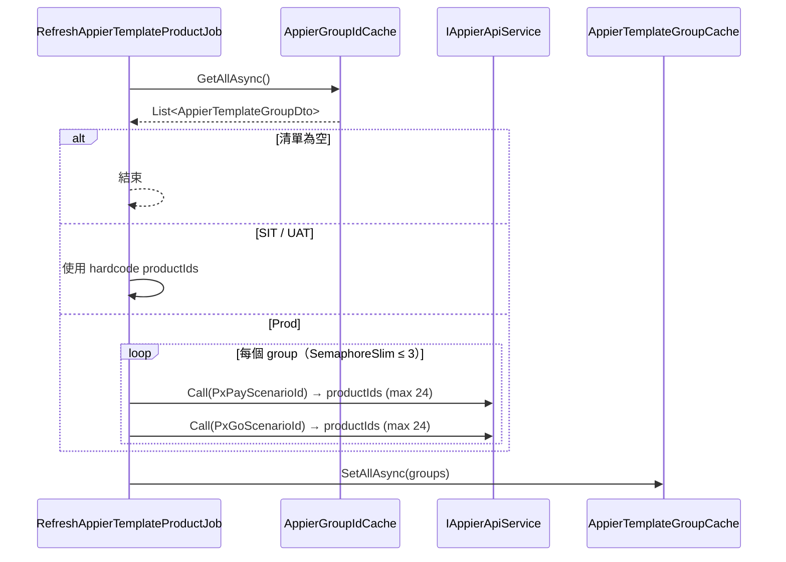
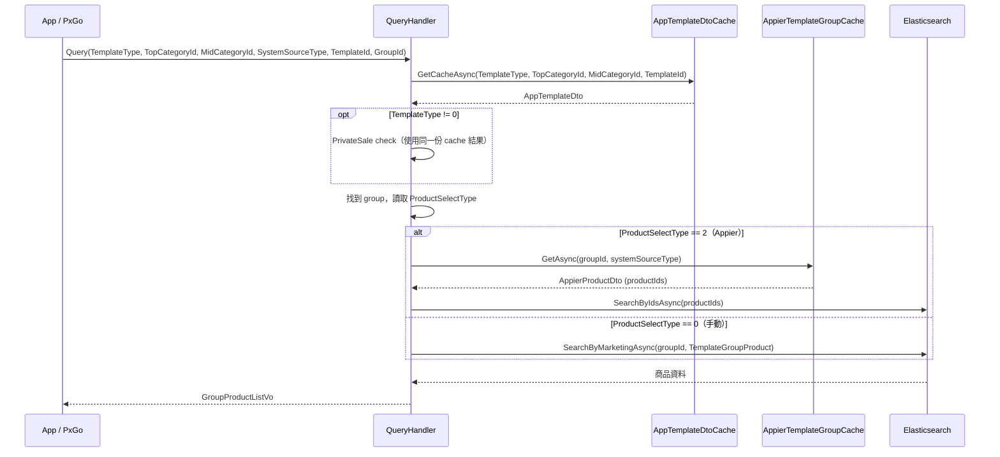

# PXBOX-26599 活動頁商品區塊增加 Appier 推薦選項

---

## Req — 需求分析

### Objective
在共用的樣板類型（活動頁、品牌頁、分類頁）的商品區塊（`TemplateBlockType.Products`）中，新增「**Appier 選品**」模式。讓後台管理者可選擇不手動指定商品，而改由第三方系統 Appier 依不同 app 動態推薦商品展示。

---

### Current State

**商品區塊寫入流程：**
```
SaveTemplateCommandHandler
  ├── CheckInputLogic()   → 商品區塊必須有 ≥1 個商品 (硬性驗證)
  └── SetBlockGroups()
        └── case Products:
              → template.SetGroupWithProduct(products: Dict<productId, sort>)
              → 資料存至 template_block_products 表
```

**前台讀取流程：**
```
GetAppGroupProductListQuery
  → Elasticsearch.SearchByMarketingAsync(TemplateGroupId, ProductMarketingType.TemplateGroupProduct)
  → 回傳 GroupProductListVo（所有人看同一份商品）
```

**ES 商品索引更新流程：**
```
RefreshTemplateCahceJob (每小時 :05 執行, cron: "5 */1 * * *")
  → GetTemplateGroupProductsAsync(groupIds)   ← 查 template_block_products
  → 組成 TemplateElasticsearchDto 存入 Redis
  → 商品被 re-index 時，ProductIndexModelConverter 讀 Redis
    → 寫入 ES 商品文件的 product_marketings:
      { id: TemplateBlockGroupId, type: TemplateGroupProduct, sort: N }
```

**Appier 現有整合 (Curating)：**
- `ScopeType.AppierProducts` 標記 Curating 排程使用 Appier 選品
- 排程存有 `PxPayScenarioId`、`PxGoScenarioId`
- `RefreshRedisCacheByAppierApiJob` 每 5 分鐘呼叫 Appier API → 依 app 各自存一份至 Redis
  - `Dict<CuratingScheduleId, Dict<SystemSourceType(PXPay/PXGo), AppierProductDto>>`

---

### Proposed Changes

1. 商品區塊的 group 新增「選品類型」欄位，支援 **手動選品 (0)** 與 **Appier 選品 (2)**（值 1 為 AI 推薦，由另一同事負責），適用範圍：活動頁、品牌頁、分類頁
2. Appier 選品模式下，使用者須填入 `PxpayScenarioId`、`PxgoScenarioId`，不需指定商品
3. 新增定時 Job，每 5 分鐘呼叫 Appier API，以 ScenarioId 分別取得 PXPay / PXGo 推薦商品（各最多 24 品），並更新快取
4. `GetAppGroupProductListQueryHandler` 在 Appier 選品模式下，須依據呼叫方是 **PXPay 或 PXGo** 回傳**不同的商品列表**；商品詳細資料須從 **Elasticsearch** 撈取最新內容（不直接回傳 Appier API 快取的商品資料）
5. Template 相關快取的其他更新頻率照舊，不影響
6. `GetAppGroupProductListQueryHandler` 中呼叫 `AppTemplateDtoCache` 的參數，須全部改由前端傳入，不得寫死（現有程式碼硬寫 `ProductMarketingType.TemplateGroupProduct = 4`，對品牌頁、分類頁會取到錯誤的 cache key）

---

### Constraints

- 現有資料（手動選品的 group）必須向下相容，`product_select_type` 預設值 = 0
- 系統須每 5 分鐘更新 Appier 推薦商品

---

### Acceptance Criteria

- 後台可在商品區塊選擇「Appier 選品」模式；選擇後，PxPay ScenarioId 與 PxGo ScenarioId 為必填欄位，且無需指定商品
- 後台手動選品模式下，商品區塊必須至少填入 1 個商品（現有驗證保持不變）
- 手動選品的既有商品區塊行為不變
- 前台在 Appier 選品模式下，PXPay / PXGo 各自取得 Appier 推薦的商品列表（最多 24 品）
- 商品詳細資料來自 Elasticsearch，非 Appier API 快取
- Appier 推薦商品每 5 分鐘自動更新
- `GetAppGroupProductListQueryHandler` 呼叫 `AppTemplateDtoCache` 時，`TemplateType`、`TopCategoryId`、`MidCategoryId` 三個參數由前端傳入，不得寫死

---

### Req 進度表

| ID | 項目 | 狀態 |
| :--- | :--- | :--- |
| R1 | Objective | Done |
| R2 | Current State | Done |
| R3 | Proposed Changes | Done |
| R4 | Constraints | Done |
| R5 | Acceptance Criteria | Done |

---

## Pre Design Sync

> 以下問題會直接影響設計細節，請逐項確認後，再產出 Design 內容。

**Q1 — GetAppGroupProductListQuery 如何識別 PXPay / PXGo**

**結論：** 在 `GetAppGroupProductListQuery` 新增 `SystemSourceType` 欄位，比照 `GetAppCuratingListQuery`：
```csharp
/// <summary>
/// PxGo = 1, PxPay = 2
/// </summary>
public int SystemSourceType { get; set; } = 2;
```

**Q2 — ES 結構如何支援 PXPay / PXGo 各自一份商品**

目前 ES 每個商品的 `product_marketings` 在同一個 groupId 只有一筆：
`{ id: TemplateBlockGroupId, type: TemplateGroupProduct, sort: N }`

**方案比較：**

| 面向 | 方案 A：新增 ProductMarketingType 值 | 方案 B：ES 新增 app_type 欄位 |
| :--- | :--- | :--- |
| **做法** | 新增 `TemplateGroupProductPxPay = 10`、`TemplateGroupProductPxGo = 11` | ES `product_marketings` 增加 `app_type` 欄位，query 時帶入 filter |
| **ES mapping 異動** | 不需要 | 需要更新 ES mapping，並 re-index 全量商品 |
| **向下相容** | 現有 `TemplateGroupProduct = 4` 完全不動 | 舊資料 `app_type` 為 null，需特別處理 |
| **修改範圍** | `ProductMarketingType` enum、Query handler | ES mapping、`ProductMarketingChangedEventHandler`、Query handler |
| **風險** | 低 | 中（re-index 期間資料不一致） |

~~**結論：採用方案 A。** 新增兩個 `ProductMarketingType` 值：~~
~~- `TemplateGroupProductPxPay = 10`~~
~~- `TemplateGroupProductPxGo = 11`~~

**Cancel：** Q7 確認採用方案二（TopSelling-like bypass），Appier 選品不走 `product_marketings`，無需新增 ProductMarketingType 值。

**Q3 — Appier 商品更新後如何觸發 ES re-index**

~~目前手動選品的商品在被異動時透過 Kafka 事件 re-index。~~
~~Appier 每 5 分鐘商品清單可能完全不同（舊商品移除、新商品加入），~~
~~需要一個機制讓 ES 同步更新，否則前台會看到錯誤的商品。~~

**Cancel：** Appier 選品不走 `product_marketings`，查詢時直接從 Redis 取商品 ID → 以 ID 查 ES，ES 回傳的永遠是最新商品資料，與 re-index 機制無關。

**Q4 — SIT / UAT hardcode 商品**

**結論：** 比照 `CuratingDtoCache` 的現有做法，在新 Job 中以 `_sitProducts` / `_uatProducts` hardcode，PXPay / PXGo 各維護一份。

**Q5 — Appier 商品 ID 快取結構與 query handler 判斷路徑**

原本討論將 Appier 專用欄位加入 `TemplateGroupElasticsearchDto`，但 Q7 確認 Appier 路徑不寫 ES，該 DTO 語意是「準備寫進 ES product_marketings 的資料」，混入 Appier 欄位語意不符。

進一步討論比較兩種做法：

| 面向 | 新 Appier Cache | AppTemplateDtoCache 加欄位 |
|---|---|---|
| **判斷方式** | 以 `TemplateGroupId` 查新 cache，有 key = Appier | 從已讀的 `AppTemplateDtoCache` 裡找 group，看 `ProductSelectType` |
| **額外 cache 讀取** | +1 次（新 cache） | 0（handler 已讀 `AppTemplateDtoCache`） |
| **寫入方維護** | 新 Appier Job 維護新 cache | `RefreshTemplateCahceJob` 與 Appier Job 各自更新同一份 cache 的不同欄位 |
| **資料耦合** | 完全解耦 | `ProductSelectType` 混在 template 結構 cache 裡 |
| **修改範圍** | 新增 cache class | 修改現有 DTO + cache |

**結論：**
1. `TemplateGroupElasticsearchDto` **完全不動**
2. `AppTemplateBlockGroup`（在 `AppTemplateDto`）新增 `ProductSelectType` 欄位（0=手動, 2=Appier），由 `RefreshTemplateCahceJob` 寫入
3. 新增 Appier Cache（以 `TemplateGroupId` 為 key），只存 Appier 模式 group 的 `{ PxPay: [productIds], PxGo: [productIds] }`，由新 Appier Job 每 5 分鐘更新
4. `GetAppGroupProductListQueryHandler` 從已讀的 `AppTemplateDtoCache` 取得 `ProductSelectType`：
   - `0` → 走原本 ES `SearchByMarketingAsync`
   - `1` → 從新 Appier Cache 取商品 ID → `SearchByIdsAsync`

**Q6 — Appier 商品移除後 ES product_marketings 的殘留問題**

**Cancel：** Q7 確認採用方案二（TopSelling-like bypass），Appier 選品不走 `product_marketings`，無需事件機制處理殘留問題。

> ~~比照 `ProductMarketingChangedEventHandler` 的現有機制，Appier Job 更新 Redis 前先讀出舊的商品列表，比對差異後，對異動的商品發布 `ProductMarketingChangedEvent`~~

**Q7 — Appier 選品查詢方式：更新 ES product_marketings vs TopSelling-like bypass**

現有 TopSelling / Curating Appier 已採用 bypass 做法（Redis ID → `SearchByIdsAsync`），不寫 product_marketings。
調查確認，整個 codebase 中用 `group_id + TemplateGroupProduct` 查 ES 且會走到 Appier 選品 group 的，只有 `GetAppGroupProductListQueryHandler`。`FlashSaleDtoCache`（限時必搶）雖然也用相同的查詢方式，但限時必搶有自己的一套 API，不走 `SaveTemplateHandler`，其 group 永遠不會被設為 Appier 模式，故不在考慮範圍內。

**方案比較：**

| 面向 | 方案一：更新 ES product_marketings | 方案二：TopSelling-like bypass |
| :--- | :--- | :--- |
| **做法** | Job 比對差異 → publish `ProductMarketingChangedEvent` → ES `product_marketings` 寫入 `TemplateGroupProductPxPay/PxGo` | Job 取 Appier 商品 ID 只存 Redis；查詢時從 Redis 取 ID → `SearchByIdsAsync` in ES |
| **ES 資料異動** | 是，product_marketings 需寫入 / 移除 | 否，product_marketings 完全不動 |
| **Q2 新 enum 是否需要** | 是 | 否 |
| **Q6 事件機制是否需要** | 是 | 否 |
| **受影響查詢** | `GetAppGroupProductListQueryHandler` | `GetAppGroupProductListQueryHandler`（加 Appier 分支） |
| **現有範例** | 無 | `TopSellingCache`、`CuratingDtoCache`（Appier 模式） |
| **修改複雜度** | 高 | 低，比照現有模式 |
| **風險** | 中（事件機制、ES partial update） | 低 |

**結論：** 採用方案二（TopSelling-like bypass）。Job 取得 Appier 商品 ID 後只存 Redis；查詢時從 Redis 取 ID → `SearchByIdsAsync` in ES，`product_marketings` 完全不動。比照 `TopSellingCache` / `CuratingDtoCache`（Appier 模式）現有實作。

**Q8 — `SaveTemplateCommandHandler` 商品驗證在 Appier 模式下的處理**

Current State 的 `CheckInputLogic()` 有「商品區塊必須有 ≥1 個商品」的硬性驗證，`SetBlockGroups()` 也會呼叫 `SetGroupWithProduct()` 寫入 `template_block_products`。Appier 選品模式下使用者不指定商品，這兩處的行為需要確認。

**結論：** Appier 選品模式下，`CheckInputLogic()` 跳過「商品區塊必須有 ≥1 個商品」的驗證；`SetBlockGroups()` 改儲存 `PxPayScenarioId` / `PxGoScenarioId`，不呼叫 `SetGroupWithProduct()`。

Req 提到「使用者須填入 PxpayScenarioId、PxgoScenarioId」，但 `SaveTemplateCommandHandler` 目前 input 只有商品列表，儲存 ScenarioId 的後台 API 改動是否也在此次範疇？

**結論：** 在此次範疇內。`SaveTemplateCommandHandler` 的 command input 需新增 `PxPayScenarioId`、`PxGoScenarioId`，並存至 `template_block_groups`（或對應欄位），後台 API 需同步調整以支援 Appier 模式的輸入。

**Q10 — Appier 推薦商品數量上限的計算方式**

Req 說「各最多 24 品」，確認是 PxPay 最多 24 品、PxGo 最多 24 品（各自獨立計算），而非合計 24 品。

**結論：** PxPay 最多 24 品、PxGo 最多 24 品，各自獨立計算，不合併。

---

**Q11 — `GetAppGroupProductListQuery` 新增 `AppTemplateDtoCache` 所需參數的向下相容策略**

目前 Handler 寫死 `type = (int)ProductMarketingType.TemplateGroupProduct = 4` 呼叫 `AppTemplateDtoCache.GetCacheAsync()`，導致品牌頁（type=1）、分類頁（type=3）會取到錯誤 cache key（會落入 else 分支，以 `template.{templateId}` 當 key，而非正確的 `brand.{topCategoryId}`）。

修正方向：在 `GetAppGroupProductListQuery` 新增 `TemplateType`、`TopCategoryId`、`MidCategoryId` 三個欄位，由前端傳入。

需確認：這三個新欄位是**必填**，還是可為 null（null 時跳過 PrivateSale 判斷）？

**結論：** `TemplateType`、`TopCategoryId`、`MidCategoryId` 為 int，預設值 0；任一欄位為 0 時，跳過封閉賣場（PrivateSale）判斷。

---

### Pre Design Sync 進度表

| ID | 項目 | 結論 | 狀態 |
| :--- | :--- | :--- | :--- |
| Q1 | Query 識別 PXPay/PXGo | 新增 `SystemSourceType` 欄位，PxGo=1, PxPay=2 | Done |
| Q2 | ES 結構方案 | Q7 採方案二，Appier 不走 product_marketings，新 enum 值不需要 | Cancel |
| Q3 | Appier 更新後 ES re-index 機制 | Appier 不走 product_marketings，直接 Redis ID → ES 查詢，機制無關 | Cancel |
| Q4 | SIT/UAT hardcode 商品 | 比照 CuratingDtoCache，PXPay / PXGo 各一份 hardcode | Done |
| Q5 | TemplateGroupElasticsearchDto 快取結構 | `TemplateGroupElasticsearchDto` 不動；`AppTemplateBlockGroup` 加 `ProductSelectType`；新 Appier Cache 存商品 ID | Done |
| Q6 | Appier 商品移除後 ES product_marketings 殘留 | Q7 採方案二，bypass 路徑不寫 product_marketings，殘留問題不存在 | Cancel |
| Q7 | Appier 查詢方式：ES 更新 vs bypass | 採方案二：Redis ID → SearchByIdsAsync，比照 TopSelling/Curating 模式 | Done |
| Q8 | SaveTemplateCommandHandler 商品驗證 Appier 模式處理 | Appier 模式跳過商品數驗證；改儲存 ScenarioId，不呼叫 SetGroupWithProduct() | Done |
| Q9 | 後台 API 修改範圍 | 在此次範疇內，command input 新增 PxPayScenarioId / PxGoScenarioId | Done |
| Q10 | Appier 推薦商品數量上限計算方式 | PxPay 最多 24 品、PxGo 最多 24 品，各自獨立計算 | Done |
| Q11 | AppTemplateDtoCache 新增參數的向下相容策略 | TemplateType/TopCategoryId/MidCategoryId 為 int 預設 0；任一為 0 則跳過封閉賣場判斷 | Done |

---

## Design

### D1 — DB Schema

`template_block_groups` 新增 3 欄位，無新增 Index：

| 欄位 | 型別 | 預設 | 說明 |
| :--- | :--- | :--- | :--- |
| `product_select_type` | TINYINT NOT NULL | 0 | 0 = 手動選品, 2 = Appier 選品（1 = AI 推薦，另一同事負責，不在範疇） |
| `pxpay_scenario_id` | VARCHAR(100) NULL | NULL | Appier PxPay Scenario ID |
| `pxgo_scenario_id` | VARCHAR(100) NULL | NULL | Appier PxGo Scenario ID |

---

### D2 — Entity / Domain

**`TemplateBlockGroupEntity` 異動：**

| 項目 | 類型 | 說明 |
| :--- | :--- | :--- |
| `ProductSelectType` | 新增屬性 (int) | 對應 `product_select_type` |
| `PxPayScenarioId` | 新增屬性 (string?) | 對應 `pxpay_scenario_id` |
| `PxGoScenarioId` | 新增屬性 (string?) | 對應 `pxgo_scenario_id` |
| `CreateWithAppier(templateBlockId, sort, pxPayScenarioId, pxGoScenarioId)` | 新增靜態工廠 | 建立 Appier 模式 group；`TemplateBlockProducts` 初始化為空 list |
| `UpdateWithAppier(pxPayScenarioId, pxGoScenarioId)` | 新增方法 | 更新 ScenarioId；設定 `ProductSelectType = 2`；清空 `TemplateBlockProducts`（DB 刪除舊商品紀錄） |
| `Update()` (現有) | 修改 | 切換回手動時清除 `PxPayScenarioId` / `PxGoScenarioId` 為 null |

**`TemplateEntity` 異動：**

| 項目 | 類型 | 說明 |
| :--- | :--- | :--- |
| `SetGroupWithAppier(groupModel)` | 新增方法 | 建立或更新 Appier 模式 group；**不呼叫** `SetGroupWithProduct()` |

---

### D3 — Contract

**`SaveTemplateCommand.TemplateBlockGroupModel` 新增欄位：**

| 欄位 | 型別 | 說明 |
| :--- | :--- | :--- |
| `ProductSelectType` | int | 0 = 手動, 2 = Appier |
| `PxPayScenarioId` | string? | Appier 模式必填 |
| `PxGoScenarioId` | string? | Appier 模式必填 |

**`GetAppGroupProductListQuery` 新增欄位：**

| 欄位 | 型別 | 預設 | 說明 |
| :--- | :--- | :--- | :--- |
| `SystemSourceType` | int | 2 (PxPay) | PxGo = 1, PxPay = 2 |
| `TemplateType` | int | 0 | 0 = 未傳入，跳過 PrivateSale 判斷 |
| `TopCategoryId` | int | 0 | 同上 |
| `MidCategoryId` | int | 0 | 同上 |

Response `GroupProductListVo` 不異動。無新增 Event。

**`GetBackendTemplateDetailQueryHandler` 後台明細 Response 新增欄位：**

`BackendTemplateDetailVo.BackendTemplateBlockGroupInfo` 新增：

| 欄位 | 型別 | 說明 |
| :--- | :--- | :--- |
| `ProductSelectType` | int | 0 = 手動, 2 = Appier |
| `PxPayScenarioId` | string | Appier 模式的 PxPay Scenario Id |
| `PxGoScenarioId` | string | Appier 模式的 PxGo Scenario Id |

影響：`TemplateBlockGroupDto`（Dapper 映射 DTO）與 `BackendTemplateBlockGroupInfo`（VO）皆需新增對應欄位，SQL 群組檔 SELECT 需補上 3 個新欄位。

---

### D4 — Caching Strategy

**新增 `AppierGroupIdCache`：**

| 項目 | 說明 |
| :--- | :--- |
| 結構 | Redis Hash |
| Key | `spu://pxbox.appier_group_ids` |
| Field | `{TemplateGroupId}` (string) |
| Value | JSON `{ "PxPayScenarioId": "...", "PxGoScenarioId": "..." }` |
| TTL | 無（由 Job 全量覆寫） |
| Methods | `ExistsAsync(groupId)`, `GetAllAsync() → List<AppierTemplateGroupDto>`, `SetAllAsync(groups)`, `AddOrUpdateAsync(group)`, `RemoveAsync(groupId)` |

**新增 `AppierTemplateGroupCache`：**

| 項目 | 說明 |
| :--- | :--- |
| 結構 | Redis String (JSON)，每個 group 各自一個 key |
| Key | `spu://pxbox.{appier_template_group_products}.{templateGroupId}` |
| Value | `Dictionary<int, AppierProductDto>` (SystemSourceType → AppierProductDto) |
| TTL | 30 分鐘 |
| Hash Tag | `{appier_template_group_products}` 確保所有 group key 落在同一 Redis Cluster slot，支援 pipeline 批次寫入 |
| Methods | `GetAsync(templateGroupId, systemSourceType) → AppierProductDto?`, `SetAllAsync(groups)` (pipeline 批次寫入所有 group) |

**既有 `AppTemplateBlockGroup` 修改：**

| 項目 | 說明 |
| :--- | :--- |
| `ProductSelectType` | 新增欄位 (int)；由 `RefreshTemplateCahceJob` 從 DB 讀取後寫入 |

**DTO 定義：**
```csharp
public class AppierTemplateGroupDto {
    public int TemplateGroupId { get; set; }
    public string PxPayScenarioId { get; set; }
    public string PxGoScenarioId { get; set; }
}

public class AppierProductDto {
    public List<int> ProductIds { get; set; }
}
```

---

### D5 — Core Logic Spec

**驗證規則（`CheckInputLogic`）：**

| ProductSelectType | 驗證規則 |
| :--- | :--- |
| 0（手動） | 商品區塊至少 1 個商品（現有行為不變） |
| 2（Appier） | `PxPayScenarioId` 與 `PxGoScenarioId` 皆不可為空；無商品數量驗證 |

**模式切換規則（Domain 層保證）：**

| 切換方向 | 行為 |
| :--- | :--- |
| 手動 → Appier | `SetGroupWithAppier()`：清空 `TemplateBlockProducts`（EF Core 刪除舊商品紀錄）；ScenarioId 寫入 |
| Appier → 手動 | `SetGroupWithProduct()`：覆寫商品清單；`PxPayScenarioId` / `PxGoScenarioId` 清為 null |

**查詢路由規則（`GetAppGroupProductListQueryHandler`）：**

| ProductSelectType | 路徑 | Cache Miss 行為 |
| :--- | :--- | :--- |
| 0（手動） | `SearchByMarketingAsync(groupId, TemplateGroupProduct)` | N/A |
| 2（Appier） | `AppierTemplateGroupCache.GetAsync(groupId, systemSourceType)` → `SearchByIdsAsync(productIds)` | 回傳空 list，不 fallback |

**PrivateSale 判斷規則：**
- `TemplateType`、`TopCategoryId`、`MidCategoryId` 任一為 0 → 跳過封閉賣場判斷
- 否則使用同一次 `AppTemplateDtoCache` 讀取結果（不重複呼叫）

**`RefreshTemplateCahceJob` / `RefreshTemplateCahceEventHandler` 規則：**
- `ProductSelectType == 2` 的 group 過濾不寫入 `TemplateElasticsearchDto.Groups`（避免 ES 出現空 product_marketings 條目）
- `RefreshTemplateCahceJob` 額外呼叫 `AppierGroupIdCache.SetAllAsync()` 全量同步 Appier group 清單

---

### D6 — Component Flow

**① Save Template（後台儲存）**



**② RefreshTemplateCahceEventHandler（消費 Kafka 事件）**



**③ RefreshTemplateCahceJob（每小時排程）**



**④ RefreshAppierTemplateProductJob（每 5 分鐘排程）**



**⑤ GetAppGroupProductList（前台查詢）**



### Design 進度表

| ID | 項目 | 狀態 |
| :--- | :--- | :--- |
| D1 | DB Schema | Done |
| D2 | Entity / Domain | Done |
| D3 | Contract | Done |
| D4 | Caching Strategy | Done |
| D5 | Core Logic Spec | Done |
| D6 | Component Flow | Done |

---


## Task

### T1: SQL Script — DB Schema 異動
- **Reference:** `[D1]`
- **Target:** `sql/PXBOX-26599.sql`（新建）
- **Implementation Details:**
    - 新建 `sql/PXBOX-26599.sql`，對 `spu.template_block_groups` 執行 ALTER TABLE 新增 3 個欄位：
        - `product_select_type` TINYINT NOT NULL DEFAULT 0
        - `pxpay_scenario_id` VARCHAR(100) NULL
        - `pxgo_scenario_id` VARCHAR(100) NULL
    - 不新增 Index
    - 備註：此 SQL 由人工在各環境手動執行
- **Affected Files:**
    - `sql/PXBOX-26599.sql`

---

### T2: Entity — TemplateBlockGroupEntity 新增欄位與方法
- **Reference:** `[D2]`
- **Target:** `PXBox.Spu.Domain` -> `TemplateBlockGroupEntity`
- **Implementation Details:**
    - 新增 3 個 `private set` 屬性（附 `/// <summary>` XML doc comment）：
        - `ProductSelectType` (int)
        - `PxPayScenarioId` (string?)
        - `PxGoScenarioId` (string?)
    - 新增靜態工廠 `CreateWithAppier(templateBlockId, sort, pxPayScenarioId, pxGoScenarioId)`：
        - `ProductSelectType = 2`；初始化 `TemplateBlockProducts = new List<>()`（空 list）
        - 設定 `PxPayScenarioId`、`PxGoScenarioId`
    - 新增 `UpdateWithAppier(pxPayScenarioId, pxGoScenarioId)`：
        - 設定 `ProductSelectType = 2`；更新 ScenarioId
        - 呼叫 `TemplateBlockProducts.Clear()`（EF Core cascade 刪除舊商品紀錄）
    - 修改現有 `Update()` 方法：切換回手動時清除 `PxPayScenarioId = null`、`PxGoScenarioId = null`、`ProductSelectType = 0`
    - Unit Test：
        - `UpdateWithAppier_ShouldClearTemplateBlockProducts`
        - `Update_ShouldClearScenarioIds`
- **Affected Files:**
    - `src/PXBox.Spu.Domain/AggregatesModel/TemplateAggregate/TemplateBlockGroupEntity.cs`
    - `src/PXBox.Spu.Test/.../TemplateBlockGroupEntityTest.cs`（新建）

---

### T3: Entity — TemplateEntity 新增 SetGroupWithAppier
- **Reference:** `[D2]`
- **Target:** `PXBox.Spu.Domain` -> `TemplateEntity` -> `SetGroupWithAppier`
- **Implementation Details:**
    - 新增 `SetGroupWithAppier(groupModel)` 方法，比照現有 `SetGroupWithProduct()` 結構：
        - 若 group 已存在（`groupId > 0`）：呼叫 `group.UpdateWithAppier(pxPayScenarioId, pxGoScenarioId)`
        - 若不存在：呼叫 `TemplateBlockGroupEntity.CreateWithAppier(...)` 並加入 `TemplateBlockGroups`
        - **不呼叫** `SetGroupWithProduct()`
    - Unit Test：
        - `SetGroupWithAppier_NewGroup_ShouldAdd`
        - `SetGroupWithAppier_ExistingGroup_ShouldUpdate`
- **Affected Files:**
    - `src/PXBox.Spu.Domain/AggregatesModel/TemplateAggregate/TemplateEntity.cs`
    - `src/PXBox.Spu.Test/.../TemplateEntityTest.cs`（新增 test case）

---

### T4: EntityConfig — TemplateBlockGroupEntityConfig 新增欄位映射
- **Reference:** `[D1, D2]`
- **Target:** `PXBox.Spu.Infrastructure` -> `TemplateBlockGroupEntityConfig` -> `Configure`
- **Implementation Details:**
    - 在 `Configure()` 末尾新增 3 個 `Property().HasColumnName()` 映射：
        - `e => e.ProductSelectType` → `"product_select_type"`
        - `e => e.PxPayScenarioId` → `"pxpay_scenario_id"`
        - `e => e.PxGoScenarioId` → `"pxgo_scenario_id"`
    - 不加 `IsRequired()`、`HasMaxLength()`（遵守 EntityConfig 精簡規範）
- **Affected Files:**
    - `src/PXBox.Spu.Infrastructure/EntityConfig/Template/TemplateBlockGroupEntityConfig.cs`

---

### T5: Contract — SaveTemplateCommand 新增 Appier 欄位
- **Reference:** `[D3]`
- **Target:** `PXBox.Spu.API` -> `SaveTemplateCommand.TemplateBlockGroupModel`
- **Implementation Details:**
    - 在 `TemplateBlockGroupModel` 新增 3 個欄位（Request Body，`UnderLinePolicy` 自動處理 snake_case）：
        - `ProductSelectType` (int, default 0)
        - `PxPayScenarioId` (string?)
        - `PxGoScenarioId` (string?)
    - Handler 邏輯暫不異動（在 T11 實作），此 Task 只確保欄位可接收並 build 通過
- **Affected Files:**
    - `src/PXBox.Spu.API/Application/Commands/TemplateCommands/SaveTemplateCommand.cs`

---

### T6: Contract — GetAppGroupProductListQuery 新增欄位
- **Reference:** `[D3]`
- **Target:** `PXBox.Spu.API` -> `GetAppGroupProductListQuery`
- **Implementation Details:**
    - 新增 4 個 Query Parameter 欄位（`SnakeCaseQueryValueProviderFactory` 自動處理 snake_case）：
        - `SystemSourceType` (int, default 2)：PxGo = 1, PxPay = 2
        - `TemplateType` (int, default 0)：0 = 未傳入，跳過 PrivateSale 判斷
        - `TopCategoryId` (int, default 0)
        - `MidCategoryId` (int, default 0)
    - Handler 邏輯暫不異動（在 T16 實作），此 Task 只確保欄位存在並 build 通過
- **Affected Files:**
    - `src/PXBox.Spu.API/Application/Queries/App/GetTemplateBlock/GetAppGroupProductListQuery.cs`

---

### T7: API Contract 摘要（給前端）
- **Reference:** `[D3]`
- **Target:** 提供給前端工程師的 API 變更摘要（無程式碼異動）
- **Implementation Details:**
    以下摘要供前端工程師參考，可對照 Swagger 確認：

    **① POST `/backend/1.0/spu/save_template`（後台儲存）**
    - Request Body 中 `template_block_groups[]` 新增欄位：

        | 欄位 | 型別 | 說明 |
        | :--- | :--- | :--- |
        | `product_select_type` | int | 0 = 手動選品（預設）, 2 = Appier 選品 |
        | `pxpay_scenario_id` | string? | Appier 模式必填 |
        | `pxgo_scenario_id` | string? | Appier 模式必填 |

    **② GET `/app/1.0/spu/get_app_group_product_list`（前台查詢）**
    - Query Parameters 新增欄位：

        | 欄位 | 型別 | 預設 | 說明 |
        | :--- | :--- | :--- | :--- |
        | `system_source_type` | int | 2 | PxGo = 1, PxPay = 2 |
        | `template_type` | int | 0 | 0 = 未傳入，跳過封閉賣場判斷 |
        | `top_category_id` | int | 0 | 同上 |
        | `mid_category_id` | int | 0 | 同上 |
    - Response `GroupProductListVo` 不異動

    **③ GET `/backend/1.0/spu/get_template_detail`（後台明細）**
    - Response `blocks[].groups[]` 新增欄位：

        | 欄位 | 型別 | 說明 |
        | :--- | :--- | :--- |
        | `product_select_type` | int | 0 = 手動選品, 2 = Appier 選品 |
        | `pxpay_scenario_id` | string | Appier 模式的 PxPay Scenario Id |
        | `pxgo_scenario_id` | string | Appier 模式的 PxGo Scenario Id |

- **Affected Files:** （無）

---

### T17: Contract — BackendTemplateDetailVo 後台明細回傳新欄位
- **Reference:** `[D3]`
- **Target:** `PXBox.Spu.API` -> `GetBackendTemplateDetailQueryHandler`
- **Implementation Details:**
    1. `BackendTemplateDto.cs` — `TemplateBlockGroupDto` 新增欄位：
        ```csharp
        public int ProductSelectType { get; set; }
        public string PxPayScenarioId { get; set; }
        public string PxGoScenarioId { get; set; }
        ```
    2. `BackendTemplatePageDetailVo.cs` — `BackendTemplateBlockGroupInfo` 新增欄位（含 XML doc）：
        ```csharp
        /// <summary>選品類型<br/>0: 手動選品<br/>2: Appier 選品</summary>
        public int ProductSelectType { get; set; }
        /// <summary>Appier PxPay Scenario Id</summary>
        public string PxPayScenarioId { get; set; }
        /// <summary>Appier PxGo Scenario Id</summary>
        public string PxGoScenarioId { get; set; }
        ```
        `groups.Add(new BackendTemplateBlockGroupInfo() {...})` mapping 補上：
        ```csharp
        ProductSelectType = group.ProductSelectType,
        PxPayScenarioId = group.PxPayScenarioId,
        PxGoScenarioId = group.PxGoScenarioId,
        ```
    3. `GetBackendTemplateDetailQueryHandler.cs` — 群組檔 SQL `SELECT` 補上 3 個欄位：
        ```sql
        tbg.product_select_type AS ProductSelectType,
        tbg.pxpay_scenario_id   AS PxPayScenarioId,
        tbg.pxgo_scenario_id    AS PxGoScenarioId
        ```
    - 此 Task 只擴欄位、不含 Appier 模式的業務邏輯，確保後台編輯畫面能正確顯示 / 保存現有 Appier 設定
- **Affected Files:**
    - `src/PXBox.Spu.API/Application/Models/BackendTemplateDto.cs`
    - `src/PXBox.Spu.API/ViewModels/Backend/BackendTemplatePageDetailVo.cs`
    - `src/PXBox.Spu.API/Application/Queries/Backend/GetBackendTemplate/GetBackendTemplateDetailQueryHandler.cs`

---

### T8: Cache — AppierGroupIdCache
- **Reference:** `[D4]`
- **Target:** `PXBox.Spu.API` -> `AppierGroupIdCache`（新建）
- **Implementation Details:**
    - 新建 `src/PXBox.Spu.API/Caches/Template/AppierGroupIdCache.cs`
    - 同檔定義 DTO：
        ```csharp
        public class AppierTemplateGroupDto {
            public int TemplateGroupId { get; set; }
            public string PxPayScenarioId { get; set; }
            public string PxGoScenarioId { get; set; }
        }
        ```
    - Redis Hash：Key = `spu://pxbox.appier_group_ids`；Field = TemplateGroupId（string）；Value = JSON `AppierTemplateGroupDto`
    - 實作方法：
        - `ExistsAsync(int groupId) → bool`：`HashExistsAsync(key, groupId.ToString())`
        - `GetAllAsync() → List<AppierTemplateGroupDto>`：`HashGetAllAsync(key)` 後反序列化 Value
        - `SetAllAsync(List<AppierTemplateGroupDto> groups)`：先 `KeyDeleteAsync`，再 `HashSetAsync(key, entries[])`
        - `AddOrUpdateAsync(AppierTemplateGroupDto group)`：`HashSetAsync(key, groupId, json)`
        - `RemoveAsync(int groupId)`：`HashDeleteAsync(key, groupId.ToString())`
- **Affected Files:**
    - `src/PXBox.Spu.API/Caches/Template/AppierGroupIdCache.cs`（新建）

---

### T9: Cache — AppierTemplateGroupCache
- **Reference:** `[D4]`
- **Target:** `PXBox.Spu.API` -> `AppierTemplateGroupCache`（新建）
- **Implementation Details:**
    - 新建 `src/PXBox.Spu.API/Caches/Template/AppierTemplateGroupCache.cs`
    - 同檔定義 DTO：
        ```csharp
        public class AppierProductDto {
            public List<int> ProductIds { get; set; }
        }
        ```
    - Redis String per-group：Key = `spu://pxbox.{appier_template_group_products}.{templateGroupId}`；TTL = 30 分鐘
    - Hash tag `{appier_template_group_products}` 確保所有 key 落同一 Redis Cluster slot（支援 pipeline 批次寫入）
    - 實作方法：
        - `GetAsync(int templateGroupId, int systemSourceType) → AppierProductDto?`：`StringGetAsync(key)` 後反序列化 `Dictionary<int, AppierProductDto>`，再取 `systemSourceType` 對應值
        - `SetAllAsync(Dictionary<int, Dictionary<int, AppierProductDto>> groups)`：使用 `IBatch` pipeline，逐一 `StringSetAsync(key, json, TimeSpan.FromMinutes(30))`
- **Affected Files:**
    - `src/PXBox.Spu.API/Caches/Template/AppierTemplateGroupCache.cs`（新建）

---

### T10: DTO — AppTemplateBlockGroup 新增 ProductSelectType
- **Reference:** `[D4, D5]`
- **Target:** `PXBox.Spu.API` -> `AppTemplateDto.AppTemplateBlockDto.AppTemplateBlockGroup`
- **Implementation Details:**
    - 在 nested class `AppTemplateBlockGroup` 新增：
        ```csharp
        /// <summary>
        /// 選品類型
        /// <br/>0: 手動選品
        /// <br/>2: Appier 選品
        /// </summary>
        public int ProductSelectType { get; set; }
        ```
    - 此 Task 只新增欄位；`RefreshTemplateCahceJob` 的賦值邏輯在 T12 中實作
- **Affected Files:**
    - `src/PXBox.Spu.API/Caches/Template/AppTemplateDto.cs`

---

### T11: Handler — SaveTemplateCommandHandler Appier 模式支援
- **Reference:** `[D2, D5, D6]`
- **Target:** `PXBox.Spu.API` -> `SaveTemplateCommandHandler` -> `CheckInputLogic`, `SetBlockGroups`
- **Implementation Details:**
    - `CheckInputLogic()`：遍歷 groups，依 `ProductSelectType` 分支驗證：
        - `== 2`（Appier）：`PxPayScenarioId` 與 `PxGoScenarioId` 皆不可為 null/empty，否則拋 `PXECException`；跳過商品數量驗證
        - `== 0`（手動）：現有驗證邏輯不動
    - `SetBlockGroups()`：
        - `ProductSelectType == 2`：改呼叫 `template.SetGroupWithAppier(group)`
        - `ProductSelectType == 0`：維持現有 `template.SetGroupWithProduct(products)` 邏輯
    - `SaveEntitiesAsync()` 後**不再呼叫** AppierGroupIdCache（移至 EventHandler T13）
    - Unit Test：
        - `Appier_MissingScenarioId_ShouldThrow`
        - `Appier_ShouldCallSetGroupWithAppier`
- **Affected Files:**
    - `src/PXBox.Spu.API/Application/Commands/TemplateCommands/SaveTemplateCommandHandler.cs`
    - `src/PXBox.Spu.Test/.../SaveTemplateCommandHandlerTest.cs`

---

### T12: Job — RefreshTemplateCahceJob AppierGroupIdCache 更新
- **Reference:** `[D5, D6]`
- **Target:** `PXBox.Spu.API` -> `RefreshTemplateCahceJob` -> 主執行流程
- **Implementation Details:**
    - 注入 `AppierGroupIdCache`
    - 從查詢結果中過濾 `ProductSelectType == 2` 的 groups
    - Appier groups **不寫入** `TemplateElasticsearchDto.Groups`（避免空 product_marketings 條目）
    - 確認 `AppTemplateBlockGroup.ProductSelectType` 在組裝 cache DTO 時從 DB 查詢結果賦值（補上 mapping）
    - 呼叫 `AppierGroupIdCache.SetAllAsync(appierGroups)` 全量同步
- **Affected Files:**
    - `src/PXBox.Spu.API/Jobs/RefreshTemplateCahceJob.cs`

---

### T13: EventHandler — RefreshTemplateCahceEventHandler 新增 Appier 快取更新
- **Reference:** `[D4, D6]`
- **Target:** `PXBox.Spu.API` -> `RefreshTemplateCahceEventHandler` -> `Handle`
- **Implementation Details:**
    - 建構子新增注入：`AppierGroupIdCache`、`IAppierApiService`、`AppierTemplateGroupCache`
    - `Handle()` 中，更新 `AppTemplateDtoCache` 後新增：
        1. 找出所有 `ProductSelectType == 2` 的 groups
        2. Loop 每個 Appier group：`AppierGroupIdCache.AddOrUpdateAsync(group)`
        3. Loop 每個 Appier group（即時補充，減少空窗）：
            - `IAppierApiService.GetRecommendProductsAsync(PxPayScenarioId)` → productIds（max 24）
            - `IAppierApiService.GetRecommendProductsAsync(PxGoScenarioId)` → productIds（max 24）
            - 組成 `Dictionary<int, AppierProductDto>`（key = SystemSourceType）
        4. `AppierTemplateGroupCache.SetAllAsync(groups)` pipeline 批次寫入
- **Affected Files:**
    - `src/PXBox.Spu.API/Application/IntegrationEvents/EventHandling/RefreshTemplateCahceEventHandler.cs`

---

### T14: Job — RefreshAppierTemplateProductJob 建立
- **Reference:** `[D4, D6]`
- **Target:** `PXBox.Spu.API` -> `RefreshAppierTemplateProductJob`（新建）
- **Implementation Details:**
    - 在 `src/PXBox.Spu.API/Jobs/` 新建 `RefreshAppierTemplateProductJob.cs`，繼承 `JobBase`
    - 注入：`AppierGroupIdCache`、`IAppierApiService`、`AppierTemplateGroupCache`、`ILogger`
    - `Execute()` 流程：
        1. `AppierGroupIdCache.GetAllAsync()` 取得清單；清單為空則直接回傳
        2. 環境判斷：
            - SIT / UAT：使用 hardcode `_sitProducts` / `_uatProducts`（PXPay、PXGo 各一份 `List<int>`，比照 `CuratingDtoCache` 現有做法）
            - Prod：`SemaphoreSlim(3)` 控制並行數，loop 每個 group 分別呼叫 PxPay / PxGo ScenarioId，各取 productIds（max 24）
        3. 組成 `Dictionary<int, Dictionary<int, AppierProductDto>>`，呼叫 `AppierTemplateGroupCache.SetAllAsync(groups)` pipeline 批次更新
- **Affected Files:**
    - `src/PXBox.Spu.API/Jobs/RefreshAppierTemplateProductJob.cs`（新建）

---

### T15: DI Registration — Startup.cs 新增 Cache 與 Job
- **Reference:** `[D4, D6]`
- **Target:** `PXBox.Spu.API` -> `Startup.cs`
- **Implementation Details:**
    - 在相關 Cache 區塊末尾新增（比照 `AppTemplateDtoCache` 的 lifetime）：
        - `AppierGroupIdCache`
        - `AppierTemplateGroupCache`
    - 在 Coravel Scheduler 區塊末尾新增：
        - `scheduler.Schedule<RefreshAppierTemplateProductJob>().Cron("*/5 * * * *");`（每 5 分鐘）
- **Affected Files:**
    - `src/PXBox.Spu.API/Startup.cs`

---

### T16: QueryHandler — GetAppGroupProductListQueryHandler Appier 路由
- **Reference:** `[D3, D5, D6]`
- **Target:** `PXBox.Spu.API` -> `GetAppGroupProductListQueryHandler` -> `Handle`
- **Implementation Details:**
    - 注入 `AppierTemplateGroupCache`
    - 修正 `AppTemplateDtoCache.GetCacheAsync()` 呼叫：改用 query 傳入的 `TemplateType`、`TopCategoryId`、`MidCategoryId`（移除硬寫 `ProductMarketingType.TemplateGroupProduct = 4`）
    - PrivateSale 判斷：`TemplateType`、`TopCategoryId`、`MidCategoryId` 任一為 0 → 跳過；否則使用同一次 cache 讀取結果
    - 找到目標 group 後依 `ProductSelectType` 分支：
        - `0`（手動）：維持現有 `SearchByMarketingAsync(groupId, TemplateGroupProduct)`
        - `2`（Appier）：
            1. `AppierTemplateGroupCache.GetAsync(groupId, request.SystemSourceType)`
            2. Cache miss → 回傳空 list（不 fallback）
            3. Cache hit → `SearchByIdsAsync(productIds)` 取得商品資料
    - Unit Test：
        - `Appier_CacheHit_ShouldCallSearchByIds`
        - `Appier_CacheMiss_ShouldReturnEmpty`
        - `Manual_ShouldCallSearchByMarketing`
        - `PrivateSale_AnyParamZero_ShouldSkip`
- **Affected Files:**
    - `src/PXBox.Spu.API/Application/Queries/App/GetTemplateBlock/GetAppGroupProductListQueryHandler.cs`
    - `src/PXBox.Spu.Test/.../GetAppGroupProductListQueryHandlerTest.cs`

---

### Task 進度表

| ID | 項目 | 引用 | 狀態 |
| :--- | :--- | :--- | :--- |
| T1 | SQL Script — DB Schema 異動 | D1 | Done |
| T2 | Entity — TemplateBlockGroupEntity 新增欄位與方法 | D2 | Done |
| T3 | Entity — TemplateEntity 新增 SetGroupWithAppier | D2 | Done |
| T4 | EntityConfig — TemplateBlockGroupEntityConfig 新增欄位映射 | D1, D2 | Done |
| T5 | Contract — SaveTemplateCommand 新增 Appier 欄位 | D3 | Done |
| T6 | Contract — GetAppGroupProductListQuery 新增欄位 | D3 | Done |
| T17 | Contract — BackendTemplateDetailVo 後台明細回傳新欄位 | D3 | Done |
| T7 | API Contract 摘要（給前端） | D3 | Done |
| T8 | Cache — AppierGroupIdCache | D4 | Done |
| T9 | Cache — AppierTemplateGroupCache | D4 | Done |
| T10 | DTO — AppTemplateBlockGroup 新增 ProductSelectType | D4, D5 | Done |
| T11 | Handler — SaveTemplateCommandHandler Appier 模式支援 | D2, D5, D6 | Done |
| T12 | Job — RefreshTemplateCahceJob AppierGroupIdCache 更新 | D5, D6 | Done |
| T13 | EventHandler — RefreshTemplateCahceEventHandler Appier 快取更新 | D4, D6 | Done |
| T14 | Job — RefreshAppierTemplateProductJob 建立 | D4, D6 | Done |
| T15 | DI Registration — Startup.cs 新增 Cache 與 Job | D4, D6 | Review |
| T16 | QueryHandler — GetAppGroupProductListQueryHandler Appier 路由 | D3, D5, D6 | Review |

