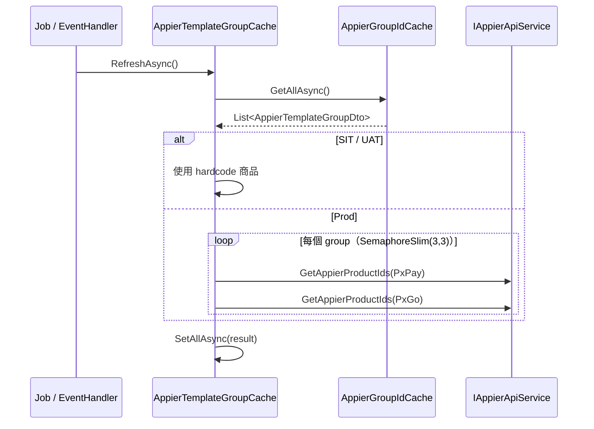
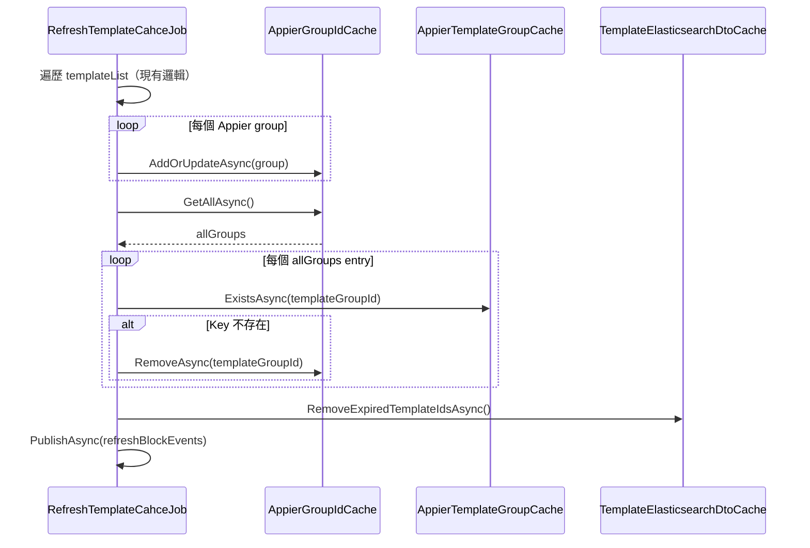

# PXBOX-26599 Phase 2 — Appier 快取機制優化

---

## Req — 需求分析

### Objective

針對 Phase 1 實作後發現的四項技術問題進行修正與優化：

1. `AppierGroupIdCache.SetAllAsync()` 採用「先刪後寫」策略，在刪除與寫入之間存在快取空窗期
2. `TemplateElasticsearchDtoCache` 紀錄有商品區塊 template 的 Set（`_hasProductTemplateIdsKey`）只增不減，已下架/過期的 templateId 不會被清除
3. 呼叫 Appier API 取商品 ID 的邏輯散落在 `RefreshAppierTemplateProductJob` 與 `RefreshTemplateCahceEventHandler` 中，導致重複邏輯且不易維護
4. SIT/UAT 的 hardcode 商品目前分 PxPay/PxGo 兩組寫死，但內容完全相同，暫無需分開

---

### Current State

**AppierGroupIdCache.SetAllAsync() 空窗期：**
```
SetAllAsync()
  ├── KeyDeleteAsync(_key)         ← 此刻 Redis hash 已清空
  └── HashSetAsync(_key, entries)  ← 寫入期間其他 Pod 讀到空資料
```

**TemplateElasticsearchDtoCache 過期 templateId 未清除：**
```
SetTemplateGroupProductCacheAsync()
  └── PushTemplateHasProductsItemAsync(templateId)
        └── SetAddAsync(_hasProductTemplateIdsKey, templateId)   ← 只加不刪
GetAppTemplateHasProductBlockByActive()
  └── GetTemplateHasProductsIdAsync()
        └── 讀取 Set 後遍歷，包含已過期的 templateId
```

**取 Appier 商品邏輯重複：**
- `RefreshAppierTemplateProductJob.Run()`：含 SIT/UAT hardcode 邏輯 + Prod API 呼叫 + `SetAllAsync()`
- `RefreshTemplateCahceEventHandler.UpdateAppierCachesAsync()`：含 Prod API 呼叫（無 SIT/UAT hardcode）+ `SetAllAsync()`
- 兩者各自維護完整的商品組裝邏輯，邏輯不一致

---

### Proposed Changes

1. **AppierGroupIdCache 移除失效元素策略調整**
   - 移除 `SetAllAsync()` 的「先刪後寫」實作
   - 改由 `RefreshTemplateCahceJob` 在同步完成後，遍歷 `AppierGroupIdCache` 的所有 entry，查詢其在 `AppierTemplateGroupCache` 是否有對應商品快取；若無則從 `AppierGroupIdCache` 中移除

2. **TemplateElasticsearchDtoCache 過期清除機制**
   - 比照上述策略，在 `RefreshTemplateCahceJob` 中，遍歷 `_hasProductTemplateIdsKey` Set 的所有 templateId，查詢各 templateId 的商品快取是否存在；若不存在（Key 已過期）則從 Set 中移除

3. **Appier 商品取得邏輯集中至快取層**
   - 在 `AppierTemplateGroupCache` 新增 `RefreshAsync(List<AppierTemplateGroupDto> groups)` 方法，封裝：
     - SIT/UAT 環境的 hardcode 商品邏輯
     - Prod 環境的 Appier API 呼叫邏輯（含 SemaphoreSlim 並行控制）
     - 組裝後寫入 `SetAllAsync()`
   - `RefreshAppierTemplateProductJob` 與 `RefreshTemplateCahceEventHandler` 改呼叫此方法，移除各自的商品組裝邏輯

4. **SIT/UAT hardcode 維持現狀**
   - 目前 PxPay/PxGo 各自寫死相同商品清單，不需拆分，維持一組 hardcode 同時套用兩者

---

### Constraints

- 不影響 Phase 1 已完成的功能（手動選品、Appier 選品路由、DB schema）
- `AppierGroupIdCache` 移除失效 entry 的時機為 `RefreshTemplateCahceJob` 執行後，不影響 `AppierGroupIdCache.SetAllAsync()` 現有呼叫方

---

### Acceptance Criteria

- `AppierGroupIdCache` 不再出現「先刪後寫」的空窗期；過期/已移除的群組 entry 會在下一次 `RefreshTemplateCahceJob` 執行後自動清除
- `TemplateElasticsearchDtoCache` 的 `_hasProductTemplateIdsKey` Set 中不再累積過期的 templateId
- `RefreshAppierTemplateProductJob` 與 `RefreshTemplateCahceEventHandler` 中不再含有取 Appier 商品的重複邏輯
- 取商品邏輯統一由 `AppierTemplateGroupCache.RefreshAsync()` 提供

---

### Req 進度表

| ID | 項目 | 狀態 |
| :--- | :--- | :--- |
| R1 | Objective | Done |
| R2 | Current State | Done |
| R3 | Proposed Changes | Done |
| R4 | Constraints | Done |
| R5 | Acceptance Criteria | Done |

---

## Pre Design Sync

### Q1 — AppierGroupIdCache 移除依據

目前構想：遍歷 `AppierGroupIdCache` 所有 entry，若該 `templateGroupId` 在 `AppierTemplateGroupCache` 不存在商品快取即移除。

但有個潛在問題：`AppierTemplateGroupCache` TTL 為 30 分鐘，`RefreshAppierTemplateProductJob` 每 5 分鐘執行。若在 `RefreshTemplateCahceJob`（每小時 :05）執行時，某 group 的商品快取恰好過期（尚未被 Job 刷新），會誤判為「失效」而被移除。

| 方案 | 判斷依據 | 優點 | 缺點 |
| :--- | :--- | :--- | :--- |
| A | `AppierTemplateGroupCache` Key 是否存在 | 簡單，不需查 DB | 需連續失敗多次才誤判 |
| B | 比對 DB 活躍 template 清單中的 Appier groupId | 語義正確 | 有競態問題（見結論） |

**結論：方案 A。**

不採用方案 B 是因為：`RefreshTemplateCahceJob` 以 DB 查詢快照為基準，若使用者恰好在 Job 執行期間新增 Appier group，`RefreshTemplateCahceEventHandler` 已立即將該 group 寫入 `AppierGroupIdCache`，但此 group 不在 DB 快照中，會被誤刪（競態問題）。

同時將 `AppierTemplateGroupCache` TTL 從 30 分鐘延長至 **2 小時**，使 `RefreshAppierTemplateProductJob` 需連續失敗 **24 次**以上才可能誤判，風險極低。

---

### Q2 — TemplateElasticsearchDtoCache 移除過期 templateId 的依據

`_hasProductTemplateIdsKey` Set 只增不減，清除方式：

| 方案 | 判斷依據 | 優點 | 缺點 |
| :--- | :--- | :--- | :--- |
| A | `KeyExistsAsync` 查對應 Redis Key 是否存在（TTL 過期即清除） | 不需 DB，純快取層操作 | 快取層之間有時序耦合 |
| B | 比對 DB 活躍 template 清單，不在清單內即清除 | 語義正確 | 同 Q1，有競態問題 |

**結論：方案 A。**

在 `RefreshTemplateCahceJob` 執行後，遍歷 `_hasProductTemplateIdsKey` Set 的所有 templateId，對每個呼叫 `KeyExistsAsync` 查對應的商品快取 Key 是否存在，不存在則從 Set 中移除。純快取層操作，無需查 DB。

---

### Q3 — AppierTemplateGroupCache.RefreshAsync() 參數型別

邏輯移入快取層後，方法需要各群組的 ScenarioId。由呼叫方（Job / EventHandler）先從 `AppierGroupIdCache` 讀取後傳入 `List<AppierTemplateGroupDto>`，或由快取層自行注入 `AppierGroupIdCache` 再讀取？

| 方案 | 做法 | 優點 | 缺點 |
| :--- | :--- | :--- | :--- |
| A | 呼叫方傳入 `List<AppierTemplateGroupDto>` | 快取層職責單純 | 呼叫方多一步讀取 |
| B | `AppierTemplateGroupCache` 注入 `AppierGroupIdCache` 自行讀取 | 呼叫方更簡潔，Job 只需呼叫 `RefreshAsync()` | 快取層互相依賴 |

**結論：方案 B。**

比照 `RefreshCuratingMemoryCacheJob` + `CuratingDtoCache` 的模式：Job 職責只是「定時觸發刷新」，不需知道快取層如何取得資料。`AppierTemplateGroupCache` 注入 `AppierGroupIdCache`，自行讀取所有 groupId 後執行更新邏輯。

---

### Q4 — IAppierApiService 注入位置

邏輯移入快取層後，`IAppierApiService` 需在 `AppierTemplateGroupCache` 中注入。目前快取層只依賴 Redis，加入外部 API 依賴是否可接受？

**結論：可接受。**

`CuratingDtoCache` 已有相同模式：建構子注入 `IAppierApiService`、`IElasticsearchClientService`、`IInfraQuery` 等外部依賴，並在 `RefreshMemoryCacheAsync()` 中呼叫外部 API。`AppierTemplateGroupCache` 比照此模式即可。

---

### Pre Design Sync 進度表

| ID | 項目 | 結論 | 狀態 |
| :--- | :--- | :--- | :--- |
| Q1 | AppierGroupIdCache 移除依據 | 方案 A：查 AppierTemplateGroupCache Key 是否存在。不採用 DB 比對是因為 Job 以 DB 快照為準時，若使用者在 Job 執行期間剛好新增 Appier group，EventHandler 寫入 AppierGroupIdCache 的資料會被誤刪（競態問題）。同時將 AppierTemplateGroupCache TTL 延長至 2 小時，讓 Job 需連續失敗 24 次才會誤判 | Done |
| Q2 | TemplateElasticsearchDtoCache 移除依據 | 方案 A：KeyExistsAsync 純快取層操作 | Done |
| Q3 | RefreshAsync 參數型別 | 方案 B：快取層自行注入 AppierGroupIdCache 讀取，比照 CuratingDtoCache 模式，Job 只需呼叫 RefreshAsync() | Done |
| Q4 | IAppierApiService 注入位置 | 可接受，比照 CuratingDtoCache 注入模式 | Done |

---

## Design

### D1 — AppierTemplateGroupCache 重構

**變更目標：** 將取 Appier 商品邏輯集中至快取層，並延長 TTL / 新增輔助方法。

#### 新增建構子依賴

```csharp
public AppierTemplateGroupCache(
    ConnectionMultiplexer redis,
    ILogger<AppierTemplateGroupCache> logger,
    AppierGroupIdCache appierGroupIdCache,
    IAppierApiService appierApiService,
    IOptions<AppierSetting> appierSetting)
```

#### TTL 調整

| 項目 | 舊值 | 新值 |
| :--- | :--- | :--- |
| `_ttl` | 30 分鐘 | 2 小時 |

#### 新增 / 修改方法

```csharp
// 新增：供 RefreshTemplateCahceJob 清除邏輯使用
public async Task<bool> ExistsAsync(int templateGroupId)

// 新增：集中取得 Appier 商品並寫入快取
public async Task RefreshAsync()
```

**`RefreshAsync()` 內部邏輯：**

```
1. 從 AppierGroupIdCache 讀取所有群組（GetAllAsync）
2. if 無資料 → return
3. 根據環境（ASPNETCORE_ENVIRONMENT）分支：
   SIT / UAT → 使用 hardcode 商品清單（SIT、UAT 各一組，PxPay 與 PxGo 共用同一組）
   其他（Prod）→ 以 SemaphoreSlim(3,3) 並行呼叫 AppierApiService，分別取 PxPay / PxGo 各群組商品
4. 組裝 Dictionary<int, Dictionary<int, AppierProductDto>>
5. 呼叫 SetAllAsync(result)
```

SIT / UAT hardcode 清單從 `RefreshAppierTemplateProductJob` 移至此處：

| 環境 | 商品清單（PxPay 與 PxGo 共用） |
| :--- | :--- |
| SIT | 2393, 2392, 2391, 2387, 2385, 2384, 2383, 2382, 2381, 2375 |
| UAT | 13333, 13325, 12914, 12896, 12895, 12894, 11740, 11741, 11742, 12459, 11739, 11748, 11802, 11812, 11745, 11746, 11808, 11816, 11817, 11783, 11787, 11818 |

#### 序列圖



---

### D2 — RefreshAppierTemplateProductJob 瘦身

**變更目標：** Job 僅負責定時觸發，移除商品取得邏輯。

#### 移除依賴

- `AppierGroupIdCache`（不再需要）
- `IAppierApiService`（不再需要）
- `IOptions<AppierSetting>`（不再需要）
- 所有 hardcode 商品欄位（移至 D1）

#### 修改後 `Run()`

```csharp
public override async Task Run()
{
    try
    {
        await _appierTemplateGroupCache.RefreshAsync();
    }
    catch (Exception ex)
    {
        _logger.LogError(ex, "RefreshAppierTemplateProductJob failed");
    }
}
```

---

### D3 — RefreshTemplateCahceEventHandler 更新

**變更目標：** 移除 `IAppierApiService` 依賴，改呼叫 `AppierTemplateGroupCache.RefreshAsync()`。

#### 移除依賴

- `IAppierApiService`（不再需要）

#### `UpdateAppierCachesAsync()` 修改

原邏輯：更新 `AppierGroupIdCache` + 自行組裝商品 + `SetAllAsync`
新邏輯：更新 `AppierGroupIdCache` + 呼叫 `_appierTemplateGroupCache.RefreshAsync()`

```csharp
private async Task UpdateAppierCachesAsync(TemplateEntity template)
{
    // 1. 找出所有 Appier 群組
    var appierGroups = ...; // 同現有邏輯

    if (appierGroups.Count == 0) return;

    // 2. 更新 AppierGroupIdCache（保持 AddOrUpdateAsync，無空窗期）
    foreach (var groupDto in appierGroupDtos)
        await _appierGroupIdCache.AddOrUpdateAsync(groupDto);

    // 3. 刷新商品快取（集中邏輯）
    await _appierTemplateGroupCache.RefreshAsync();
}
```

---

### D4 — RefreshTemplateCahceJob 更新

**變更目標：**
1. 以 `AddOrUpdateAsync` 取代 `SetAllAsync`（消除空窗期）
2. 加入 AppierGroupIdCache 過期 entry 清除邏輯
3. 加入 TemplateElasticsearchDtoCache 過期 templateId 清除邏輯

#### 新增依賴

- `AppierTemplateGroupCache`（供清除邏輯使用）

#### `Run()` 主流程調整

```
現有流程：
  ... 遍歷 templateList，組裝 appierGroups ...
  SetAllAsync(appierGroups)  ← 刪除替換
  PublishAsync(refreshBlockEvents)

新流程：
  ... 遍歷 templateList，組裝 appierGroups ...
  foreach group in appierGroups:
      AddOrUpdateAsync(group)           ← 原子操作，無空窗期
  CleanStaleAppierGroupsAsync()         ← 新增：清除過期 entry
  CleanStaleTemplateIdsAsync()          ← 新增：清除過期 templateId
  PublishAsync(refreshBlockEvents)
```

#### 新增私有方法

```csharp
// 遍歷 AppierGroupIdCache，移除 AppierTemplateGroupCache 中已無對應 Key 的 entry
private async Task CleanStaleAppierGroupsAsync()
{
    var allGroups = await _appierGroupIdCache.GetAllAsync();
    foreach (var group in allGroups)
    {
        if (!await _appierTemplateGroupCache.ExistsAsync(group.TemplateGroupId))
            await _appierGroupIdCache.RemoveAsync(group.TemplateGroupId);
    }
}

// 委派至 TemplateElasticsearchDtoCache 清除過期 templateId
private async Task CleanStaleTemplateIdsAsync()
{
    await _appTemplateCache.RemoveExpiredTemplateIdsAsync();
}
```

#### 序列圖



---

### D5 — TemplateElasticsearchDtoCache 新增清除方法

**變更目標：** 提供清除 `_hasProductTemplateIdsKey` Set 中過期 templateId 的方法。

#### 新增公開方法

```csharp
/// <summary>
/// 遍歷 _hasProductTemplateIdsKey，移除對應 Redis Key 已過期的 templateId
/// </summary>
public async Task RemoveExpiredTemplateIdsAsync()
{
    var templateIds = await GetTemplateHasProductsIdAsync();
    foreach (var templateId in templateIds)
    {
        var keyExists = await _database.KeyExistsAsync(GetTemplateProductCacheKey(templateId));
        if (!keyExists)
            await _database.SetRemoveAsync(_hasProductTemplateIdsKey, templateId);
    }
}
```

---

### Design 進度表

| ID | 項目 | 狀態 |
| :--- | :--- | :--- |
| D1 | AppierTemplateGroupCache 重構（TTL、新依賴、RefreshAsync、ExistsAsync） | Done |
| D2 | RefreshAppierTemplateProductJob 瘦身 | Done |
| D3 | RefreshTemplateCahceEventHandler 移除 IAppierApiService | Done |
| D4 | RefreshTemplateCahceJob 改用 AddOrUpdateAsync + 清除邏輯 | Done |
| D5 | TemplateElasticsearchDtoCache 新增 RemoveExpiredTemplateIdsAsync | Done |

---

## Task

### T1 — TemplateElasticsearchDtoCache：新增 RemoveExpiredTemplateIdsAsync

**引用：** D5

**檔案：** `src/PXBox.Spu.Infrastructure/Cache/Template/TemplateElasticsearchDtoCache.cs`

**內容：**
- 新增 `public async Task RemoveExpiredTemplateIdsAsync()`
- 邏輯：呼叫 `GetTemplateHasProductsIdAsync()` 取得所有 templateId，對每個呼叫 `KeyExistsAsync(GetTemplateProductCacheKey(templateId))`，若 key 不存在則 `SetRemoveAsync(_hasProductTemplateIdsKey, templateId)`

**驗證：** Build 通過；手動確認方法簽名正確

---

### T2 — AppierTemplateGroupCache：新增 ExistsAsync 與 RefreshAsync，調整建構子與 TTL

**引用：** D1

**檔案：** `src/PXBox.Spu.API/Caches/Template/AppierTemplateGroupCache.cs`

**內容：**
1. 建構子新增參數：`AppierGroupIdCache appierGroupIdCache, IAppierApiService appierApiService, IOptions<AppierSetting> appierSetting`
2. `_ttl` 從 `TimeSpan.FromMinutes(30)` 改為 `TimeSpan.FromHours(2)`
3. 新增 `public async Task<bool> ExistsAsync(int templateGroupId)` — `KeyExistsAsync(GetCacheKey(templateGroupId))`
4. 新增 `public async Task RefreshAsync()` — 讀 `AppierGroupIdCache.GetAllAsync()`，依環境分流（SIT/UAT hardcode / Prod API），組裝後呼叫 `SetAllAsync()`
5. 移入 hardcode 商品清單（SIT / UAT，PxPay 與 PxGo 共用同一組）

**驗證：** Build 通過；Startup.cs DI 需對應更新（T4）

---

### T3 — Startup.cs：AppierTemplateGroupCache DI 注入更新

**引用：** D1

**檔案：** `src/PXBox.Spu.API/Startup.cs`

**內容：**
- `AppierTemplateGroupCache` 建構子已新增依賴，確認 DI 容器能正確解析（`AppierGroupIdCache`、`IAppierApiService`、`IOptions<AppierSetting>` 均已在容器中）
- 若 `AppierTemplateGroupCache` 目前是手動 `new`，需改為 `services.AddSingleton<AppierTemplateGroupCache>()`

**驗證：** Build 通過；啟動時無 DI 解析錯誤

---

### T4 — RefreshAppierTemplateProductJob：瘦身，移除 Appier 商品取得邏輯

**引用：** D2

**檔案：** `src/PXBox.Spu.API/Jobs/RefreshAppierTemplateProductJob.cs`

**內容：**
- 移除欄位：`_appierGroupIdCache`、`_appierApiService`、`_appierSetting`、所有 hardcode 商品 List
- 移除建構子參數：`AppierGroupIdCache`、`IAppierApiService`、`IOptions<AppierSetting>`
- `Run()` 改為：
  ```csharp
  await _appierTemplateGroupCache.RefreshAsync();
  ```

**驗證：** Build 通過；Startup.cs 中對應注入無需額外調整

---

### T5 — RefreshTemplateCahceEventHandler：移除 IAppierApiService，改呼叫 RefreshAsync

**引用：** D3

**檔案：** `src/PXBox.Spu.API/Application/IntegrationEvents/EventHandling/RefreshTemplateCahceEventHandler.cs`

**內容：**
- 移除欄位 `_appierApiService` 與建構子參數 `IAppierApiService`
- `UpdateAppierCachesAsync()` 的商品組裝邏輯（Step 2 的 foreach + `SetAllAsync`）全數移除
- 改在 `AddOrUpdateAsync` 迴圈結束後呼叫 `await _appierTemplateGroupCache.RefreshAsync()`

**驗證：** Build 通過

---

### T6 — RefreshTemplateCahceJob：改用 AddOrUpdateAsync + 新增清除邏輯

**引用：** D4

**檔案：** `src/PXBox.Spu.API/Jobs/RefreshTemplateCahceJob.cs`

**內容：**
1. 建構子新增參數：`AppierTemplateGroupCache appierTemplateGroupCache`
2. 將 `await _appierGroupIdCache.SetAllAsync(appierGroups)` 改為逐筆 `AddOrUpdateAsync`
3. 新增私有方法 `CleanStaleAppierGroupsAsync()`：讀取 `AppierGroupIdCache.GetAllAsync()`，對每個 entry 呼叫 `AppierTemplateGroupCache.ExistsAsync()`，不存在則 `AppierGroupIdCache.RemoveAsync()`
4. 新增私有方法 `CleanStaleTemplateIdsAsync()`：委派至 `_appTemplateCache.RemoveExpiredTemplateIdsAsync()`
5. `Run()` 在 `AddOrUpdateAsync` 迴圈後、`PublishAsync` 前依序呼叫兩個清除方法

**驗證：** Build 通過；手動觸發 Job 後確認無空窗期錯誤

---

### Task 進度表

| ID | 項目 | 引用 | 狀態 |
| :--- | :--- | :--- | :--- |
| T1 | TemplateElasticsearchDtoCache 新增 RemoveExpiredTemplateIdsAsync | D5 | Review |
| T2 | AppierTemplateGroupCache 重構（建構子、TTL、ExistsAsync、RefreshAsync） | D1 | Review |
| T3 | Startup.cs DI 注入確認 | D1 | Review |
| T4 | RefreshAppierTemplateProductJob 瘦身 | D2 | Review |
| T5 | RefreshTemplateCahceEventHandler 移除 IAppierApiService | D3 | Review |
| T6 | RefreshTemplateCahceJob 改用 AddOrUpdateAsync + 清除邏輯 | D4 | Review |
